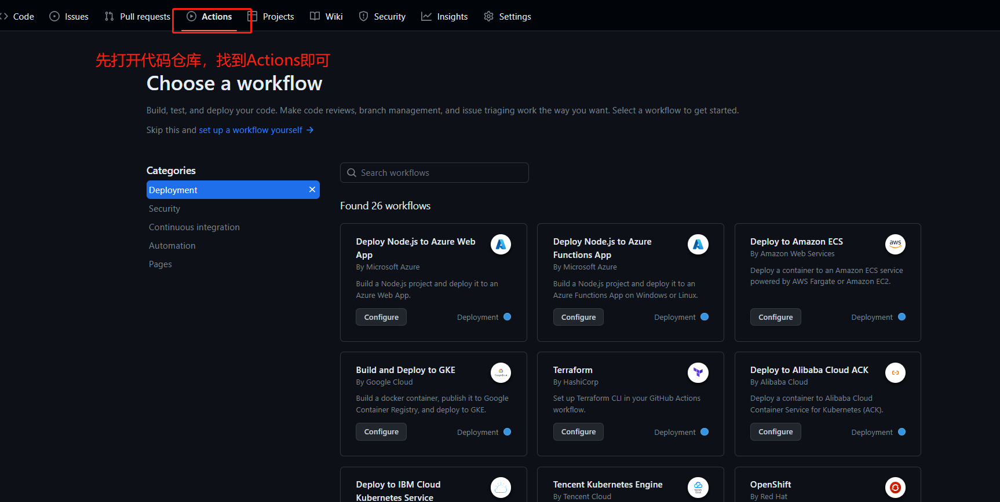

##  概述

  笔者之前一直在使用wordpress记录自己工作中的点点滴滴，分享自己的所感所触，但是随着日积月累，发现效率很低，对于管理自己的笔记非常不方便。因为我们有时候都是多种场景，比如，我们工作使用markdown来写作，但是写完之后需要同步到wordpress,这个需要花费很多的时间。特此，笔者通过网友介绍发现facebook旗下的docusaurus非常不错。因为它可以实现通过markdown来写作，然后一键push到github进行项目保存，然后通过github的action来实现一键部署到多种场景,如下图。
 

当然，也可以部署到自己的服务器。
由于笔者自己测试后，如果部署到github中的page中，由于网络原因，访问速度很慢，尤其加载图片，如果自己买了云服务器，当然可以部署到自己的云服务器中，接下来，我就是使用这种方式来部署自己docusaurus。

:::tip

Some **云服务器购买方式--->  推荐购买阿里云，腾讯云的轻量级服务器，费用比较低。** 

:::

## 操作部署

下面跟着我一步一步操作如何实现部署，废话不多说，直接上菜。

首先在仓库的根目录下，创建 .github/workflows/main.yml 文件，这就是 GitHub Actions 功能的配置文件，用于告诉 GitHub 要做哪些事情，写入以下内容

