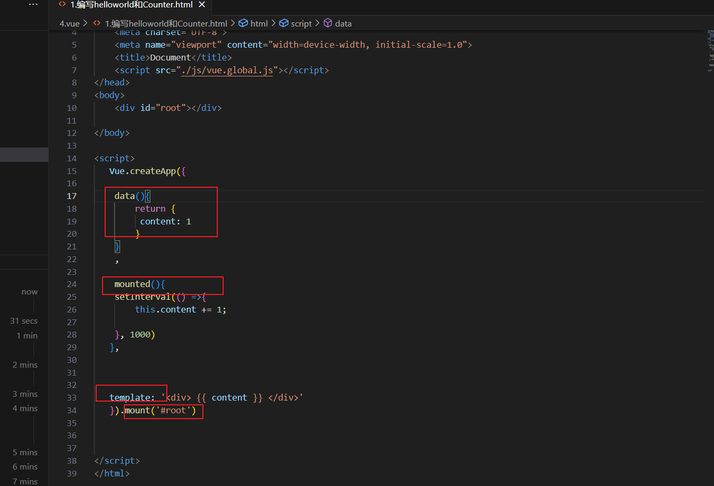
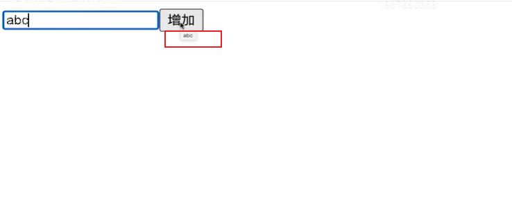
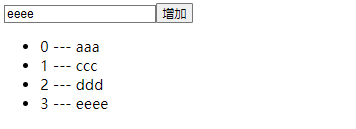
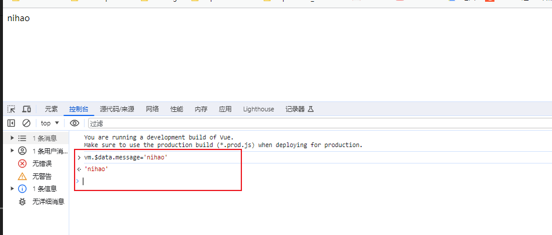
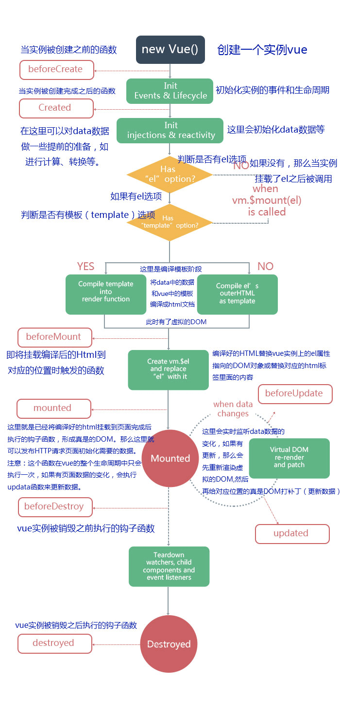
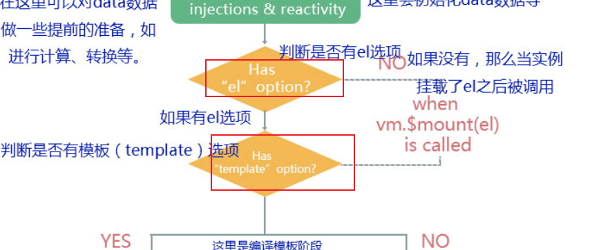

学习课件 

https://www.bilibili.com/cheese/play/ep43199?csource=common_hp_favorite_null&spm_id_from=333.999.0.0

https://www.bilibili.com/video/BV1Th411G7iN?p=1&vd_source=7434cfee3c0d52d31452f06dad54119f


## vue的基本结构

先写一个简单的hello,world来看下结构,当前主要分为三个部分组成

1.首先created是最先执行的，它是一个生命周期，也叫钩子函数，用于页面还没加载完毕时发送请求，初始化data里的值。

2.data一般用来存放vue中的变量，通过return将数据返回到created中

3.methods用来写相关模块的函数以及功能的实现，格式为async+方法名，通常通过发送请求请求到后台数据

4.computed是界于created和mounted之间发生的，此时正是页面进行渲染的时候

5.mounted是加载完dom操作后才会触发，它和created一样只会执行一次，此时页面已经渲染完成，通常用于存放需要渲染的内容


下面是一个电简单的自加计算器





按照传统的做法就是

```txt
document.getElementById('root').innerHTML(3)  //这种是手动操作的一种方式
```

之前我们是面向Dom编程，现在是面向数据编程

总结： 

数据定义： 通过data()来实现

template： 指的就是在root节点下需要渲染什么样的内容,具体是由mount中的参数来决定

mounted(): 表示页面加载完成后自动执行的命令


思考的一些问题：

我们知道一般vue使用[ajax](https://so.csdn.net/so/search?q=ajax&spm=1001.2101.3001.7020)或者axios来获取后端数据，并且好像放在created里面和mounted里面都可以获取数据并正确渲染。那么放在created里面和mounted里面有什么区别呢？

参考： 

[javascript - Vue.nextTick 的原理和用途 - 个人文章 - SegmentFault 思否](https://segmentfault.com/a/1190000012861862)

简单来说：如果你修改了某个dom中的数据，视图并不会立即更新。Vue 实现响应式并不是数据发生变化之后 DOM 立即变化，而是按一定的策略进行 DOM 的更新。，此时获取关于此dom的一切操作都是无效的，怎么办？在nextTick的回调中执行即可。$nextTick 是在下次 DOM 更新循环结束之后执行延迟回调，在修改数据之后使用 $nextTick，则可以在回调中获取更新后的 DOM。


#### js字符串反转的几种方式

#### 第一种：

**字符串转数组，反转数组，数组转字符串。**

- split(“”)：根据空字符串拆分数组
- reverse()：数组反转元素位置
- join(“”)：数组转回字符串,且不带分隔符


```
let str = "hello world";
let newStr = str.split("").reverse().join("");
console.log(newStr);
```

#### 第二种：

**使用遍历以及api `charAt()`**

```txt
let str = "hello world";
let newStr = "";
for(let i=0;i<i.length;i++){
	let s = str.charAt(str.length-i-1);
	newStr += s;
}
console.log(newStr);
```


## 2.v-on编写字符串反转


```txt
<!DOCTYPE html>
<html lang="en">
<head>
    <meta charset="UTF-8">
    <meta name="viewport" content="width=device-width, initial-scale=1.0">
    <title>Document</title>
    <script src="./js/vue.global.js"></script>
</head>
<body>
    <div id="root"></div>

</body>

<script>
   Vue.createApp({

    data(){
        return {
          content: 'hello, world'  //为什么这里定义的数据在通过console来打印不显示?
        }
    }
    ,

    // mounted(){
    // setInterval(() =>{
    //       console.log
    
    // }, 1000)
   //  },

   methods:  {
     handleBtnClick(){
        
      let newStr =   this.content.split("").reverse().join("")
      //说明: split("")意思就是按照空字符串进行打散，然后反转然后再聚合为字符串不带分隔符
      /*
split(“”)：根据空字符串拆分数组
reverse()：数组反转元素位置
join(“”)：数组转回字符串,且不带分隔符
      
      
      
      */
          console.log(newStr)
           this.content = newStr
    }
   },

   template: `
       <div>
        {{ content }}
       <button v-on:click="handleBtnClick"> 反转 </button>

       </div>
       `

   }).mount('#root')


  
</script>
</html>
```


v-on:click 用于绑定事件，相当于html中的on-click


## 3.show-内容展示或者隐藏


```txt
<!DOCTYPE html>
<html lang="en">
<head>
    <meta charset="UTF-8">
    <meta name="viewport" content="width=device-width, initial-scale=1.0">
    <title>Document</title>
    <script src="./js/vue.global.js"></script>
</head>
<body>
    <div id="root"></div>

</body>

<script>
   Vue.createApp({

    data(){
        return {
          show: true
        }
    }
    ,

    // mounted(){
    // setInterval(() =>{
    //       console.log
    
    // }, 1000)
   //  },

   methods:  {
     handleBtnClick(){

    /*
    写法1
      if (this.show == true) {
        console.log(this.show)
        this.show = false
       
       } else {
        console.log(this.show)
         this.show = true
       }
    */
     //写法2
     this.show = !this.show


    }
   },

   template: `
       <div>
        <span v-if="show"> hello, world !</span>
       <button v-on:click="handleBtnClick"> 展示/隐藏 </button>

       </div>
       `

   }).mount('#root')


  
</script>
</html>
```


总结：  

通过 true或者false来控制span标签是否展示


补充: 

this.show = !this.show  用于true跟false之间的互换


## todolist和v-model双向绑定


```txt

<body>
    <div id="root"></div>

</body>

<script>
   Vue.createApp({

    data(){
        return {
           //list: ['hello','world','dell','lee']
           list: [],
           inputValue: ''
        }
    }
    ,
    methods: {
      handleAddClick(){
        this.list.push(this.inputValue)  //把值进行赋值增加到list[]中即可 
      }
    },

   template: `
       <div>
        <input v-model="inputValue"/>   <!--v-model中的inputValue跟data中的这个值做了双向绑定----->
        <button v-on:click="handleAddClick">增加</button>
       </div>
       <div>
        <ul>
        <!---<li v-for="item of list"> {{item}}</li>--->
        <li v-for="(item,index) of list"> {{item}}  {{index}}</li>
        </ul>
       </div>
       `

   }).mount('#root')


  
</script>
```


todolist:  用于循环一个数组列表

可以使用

```txt
v-for="item of list" 
或者
v-for="(item,index) of list">  这种可以携带索引
```


v-model： 用于实现对template中的元素跟data中的数据进行绑定，输入框中输入的数据通过函数写入到data中的list表中


一个标签上的属性如果想要跟data中的数据进行绑定，需要用到的v-bind这个属性


## v-bind属性



代码参考

```txt
<script>
   Vue.createApp({

    data(){
        return {
           //list: ['hello','world','dell','lee']
           list: [],
           inputValue: ''
        }
    }
    ,
    methods: {
      handleAddClick(){
        this.list.push(this.inputValue)  //把值进行赋值增加到list[]中即可 
      }
    },

   template: `
       <div>
        <input v-model="inputValue"/>   <!--v-model中的inputValue跟data中的这个值做了双向绑定----->
        <button v-on:click="handleAddClick" v-bind:title="inputValue">增加</button>
       </div>
       <div>
        <ul>
        <!---<li v-for="item of list"> {{item}}</li>--->
        <li v-for="(item,index) of list"> {{item}}  {{index}}</li>
        </ul>
       </div>
       `

   }).mount('#root')
```


## 组件的概念1

页面上的一部分都可以看作是一部分，页面的所有的文件写到一个文件中很难维护，所哟对列表项都可以拆分为组件

每一个最小的组件就是一个Dom的一个标签

就像下面这个列表就可以拆分为一个组件出来




如何对下面的代码进行拆分呢

```txt
<body>
    <div id="root"></div>

</body>

<script>
   Vue.createApp({

    data(){
        return {
           //list: ['hello','world','dell','lee']
           list: [],
           inputValue: ''
        }
    }
    ,
    methods: {
      handleAddClick(){
        this.list.push(this.inputValue)  //把值进行赋值增加到list[]中即可 
      }
    },

   template: `
       <div>
        <input v-model="inputValue"/>   <!--v-model中的inputValue跟data中的这个值做了双向绑定----->
        <button v-on:click="handleAddClick" v-bind:title="inputValue">增加</button>
       </div>
       <div>
        <ul>
        <!---<li v-for="item of list"> {{item}}</li>--->
        <li v-for="(item,index) of list"> 
          <div>
           <span>{{index}} </span>
           <span> --- </span>
           <span> {{item}} </span>
            </div>
        </ul>
       </div>
       `

   }).mount('#root')


  
</script>
```


把下面的部分需要单独去维护

```txt
         <div>
           <span>{{index}} </span>
           <span> --- </span>
           <span> {{item}} </span>
            </div>
```

拆分后的参考

```txt
<body>
    <div id="root"></div>

</body>

<script>
   const  App =  Vue.createApp({

    data(){
        return {
           //list: ['hello','world','dell','lee']
           list: [],
           inputValue: ''
        }
    }
    ,
    methods: {
      handleAddClick(){
        this.list.push(this.inputValue)  //把值进行赋值增加到list[]中即可 
      }
    },

   template: `
       <div>
        <input v-model="inputValue"/>   <!--v-model中的inputValue跟data中的这个值做了双向绑定----->
        <button v-on:click="handleAddClick" v-bind:title="inputValue">增加</button>
       </div>
       <div>
        <ul>
        <todo-item v-for="(item,index) of list" v-bind:content="item" v-bind:index="index"> 
        </ul>
       </div>
       `

   })

   App.component('todo-item',{
    props: ['content','index'],  //在这里用于接收传递过来的两个值
    // data() {
    //     return {
    //       item: 'hello qiang'
    //     }
    // },
    template: `<div>
      <li>
        {{ content }} -- {{ index }}
      </li>
      </div>`
   })

   App.mount('#root')  //最后挂在实例
  
</script>
```


初始化一个vue实例出来

 const  App =  Vue.createApp( xxx

 App.component  用于注册组件到vue中

 App.mount('#root')  //最后挂在实例


## 组件的概念2


代码如下: 

```html
<body>
    <div id="root"></div>

</body>

<script>
   const  App =  Vue.createApp({

    data(){
        return {
          message: 'hello, world'
        }
    }
    ,

   template: '<div>{{message}}</div>'

   })

   
  const vm = App.mount('#root')
</script>
</html>
```


vm 的使用：

如何操作vue组件的数据属性，通过vm.$data 这种方式来访问，必须需要添加$





总结: 

createApp表示创建一个Vue应用,存储到app变量中

传入参数的表示，这个应用最外层的组件，应该如何展示

mvvm模式，设计模式. m -> model数据(data)， v-> view视图，vm-> viewMode视图数据连接层(vue的组件来操作)

vm代表的就是vue应用的根组件


## vue生命周期函数




```html
<!DOCTYPE html>
<html lang="en">
<head>
    <meta charset="UTF-8">
    <meta name="viewport" content="width=device-width, initial-scale=1.0">
    <title>Document</title>
    <script src="./js/vue.global.js"></script>
</head>
<body>
    <div id="root"></div>

</body>

<script>
   const  App =  Vue.createApp({
    data(){
        return {
          message: 'hello, world'
        }
    }
    ,
    //在实例生成之前自动执行的函数
    beforeCreate(){
      console.log('beforeCreate')
    },

    //在实例生成之后回自动执行的函数
    created(){
      console.log('created')
    },
    
    //在组件内被渲染到页面之前自动执行的函数
    beforeMount(){
      console.log(document.getElementById('root').innerHTML,'beforeMount')
    },
    //在组件内容被渲染到页面之后自动执行的函数
    mounted(){
      console.log(document.getElementById('root').innerHTML,'mounted')
    },   
    //当数据发生变化时会立即自动执行的函数
    beforeUpdate(){
      console.log(document.getElementById('root').innerHTML,'beforeUpdate')
    }, 
   
    //当数据发生变化，页面重新渲染后，会自动执行的函数
      updated(){
      console.log(document.getElementById('root').innerHTML,'updated')
    }, 
    //当vue应用失效时，自动执行的函数
   beforeUnmount(){
      console.log(document.getElementById('root').innerHTML,'beforeUnmount')
    }, 
    //当vue应用失效时,且dom完全销毁之后，自动执行的函数
    unmounted(){
      console.log(document.getElementById('root').innerHTML,'unmounted')
    },        
   template: '<div>{{message}}</div>'

   })

   
  const vm = App.mount('#root')
</script>
</html>
```


注意



在这张图中，在判断时，如果template不存在时，则在body中寻找匹配的模板


```html
<body>
    <div id="root">
      <div>{{message}}</div>
    </div>

</body>
```


v-html语法


```html
<body>
    <div id="root">


      <div>{{message}}</div>
    </div>

</body>

<script>
   const  App =  Vue.createApp({
    data(){
        return {
          message: '<strong> hello, world </strong>'
        }
    }
    ,    
   template: '<div>{{message}}</div>'

   })

   
  const vm = App.mount('#root')
</script>
```

但是这样不会展示加粗的效果，浏览器展示 <strong> hello, world </strong> 这样的效果

如何实现浏览器能够识别加粗呢

```html
<script>
   const  App =  Vue.createApp({
    data(){
        return {
          message: '<strong> hello, world </strong>'
        }
    }
    ,    
   template: '<div v-html="message">{{message}}</div>'

   })

   
  const vm = App.mount('#root')
</script>
```


## 模板语法一些细节

```txt
<script>
   const  App =  Vue.createApp({
    data(){
        return {
          message: '<strong> hello, world </strong>',
          disabled: true,
          name: 'title',
          event: 'mouseenter'  //鼠标划入的时候进行展示
        }
    }
    ,    
  methods: {
    handleClick(){
     alert('handleClick')
    }
  },
   template: `
   <div>
    <div v-html="message">
      {{message}}
    </div>
    <div>
      <input v-bind:disabled="disabled"/>   //控制输出的一些状态
    </div>
    <br>
    <div @[event]="handleClick" :[name]="message">
      {{message}}
      </div>


   <!----修饰符---->
   <br>
   <br>
   <div>
    <form action="https://www.baiduc.com" @click.prevent="handleClick">
       <button type="submit"> 提交 </button>
    </form>
  </div>

  </div>`

   })

   
  const vm = App.mount('#root')
</script>
```


v-on --> 简写为@

v-bind -> 简写为:


还可以通过 @[event]（v-on），:[name] （v-bind） 这种方式，通过data中定义的变量来获取。


修饰符： 比如提交跳转后，我们不让他进行调整，可以使用修饰符 @click.prevent ，通过调用函数实现修饰


## data,methods属性

data:

我们前面学习了基础的一些属性，那么了解了data的一些基本用法，在vue中是通过数据编程的一种思想,所以除了return 返回数据外，我们也可以修改data的属性


通过vm.$data 来访问和修改


methods:

也可以在{{}}内部使用方法

```html
   template: `
   <div >
    {{formatString(message)}}
  </div>`
```


计算属性和方法的区别：

比如，当内容发生变更时，计算属性和方法重新渲染网页是有区别的


1. 计算属性 computed 定义如下：

```html
  computed: {
    total(){
      // return Date.now() + this.count;  
      return Date.now()
    }
  }


  template: `
   <div >
    {{formatString(message)}}
    {{total}}
  </div>`
```

当发生下列操作时，页面的{{formatString(message)}} 会发生改变，但是total获取到的时间戳没有发生改变这个是为什么呢?

vm.$data.message="change string 2"


2. 定义方法,然后通过方法的方式进行同样的操作  

```html
  methods: {
    getTotal(){
      return Data.now();
    }

  template: `
   <div >
    {{formatString(message)}}
    {{getTotal}}
  </div>`
```

vm.$data.message="change string 2"

得到的结果就是，获取到的时间戳发生改变。


总结： 

当计算属性依赖的内容发生变更时，才会重新执行计算

定义方法，只要页面重新渲染，才会重新计算


