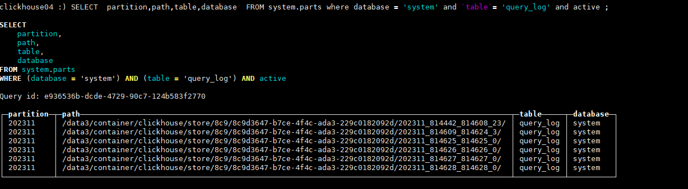
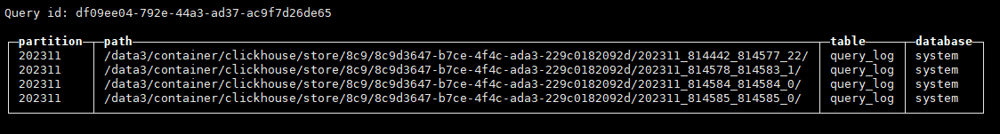

## 常用查询命令

```sql
use bjgsbp20200828

SELECT * FROM GPSContDataH3  WHERE timestamp_column >= toDateTime('2023-01-01 00:00:00') AND timestamp_column < toDateTime('2023-01-02 00:00:00');


SELECT * FROM GPSContDataH3  WHERE timestamp_column >= toDateTime('2022-12-30 00:00:00') AND timestamp_column < toDateTime('2022-12-31 00:00:00');

SELECT * FROM GPSContDataH3 WHERE unix_time= toDateTime('2023-01-01 00:00:00', 'Asia/Istanbul')


select * from GPSContDataH3 order by unix_time desc limit 1 \G


tmux new -s  datazip
tmux  attach -t 

121.36.244.174
123.60.41.178

tar zcvf  202307-202311.tar.gz ./202307new ./202308 ./202309 ./202310  ./202311


nohup bash select.sh 1 > select.log 2>&1 &
nohup bash select.sh 2 > select2.log 2>&1 &
```


## 查看每个库的大小

```shell
SELECT
    database,
    formatReadableSize(sum(data_compressed_bytes)) AS total_compressed_data_size
FROM system.parts
GROUP BY database
ORDER BY total_compressed_data_size DESC;
```


select count(1) from bshdq20220123.StressData_local WHERE unix_time<toDateTime('2023-01-01 00:00:00', 'Asia/Istanbul')


## 查看当前数据库执行的语句

```sql
##delete
select * from system.query_log where type='Delete'  order by event_time desc limit 10 \G;

##alert -> delete
select * from system.query_log where query_kind='Alter'  order by event_time desc limit 10 \G;
```


## 查询单个库的大小

```sql
SELECT
        table AS `表名`,
        sum(rows) AS `总行数`,
        formatReadableSize(sum(data_uncompressed_bytes)) AS `原始大小`,
        formatReadableSize(sum(data_compressed_bytes)) AS `压缩大小`,
        round(
                (
                        sum(data_compressed_bytes) / sum(data_uncompressed_bytes)
                ) * 100,
                0
        ) AS `压缩率`
FROM
        system.parts
WHERE
        database = 'wzskdq20211109' -- table IN ('temp_1')
GROUP BY
        table;
		
```


## 查询多个库的大小

```sql
		
SELECT
        database,
        formatReadableSize (sum(bytes)) AS bytes_size,
        formatReadableSize (sum(primary_key_bytes_in_memory)) AS primary_keys_size,
        formatReadableSize (sum(data_uncompressed_bytes)) AS `原始大小`,
        formatReadableSize (sum(data_compressed_bytes)) AS `压缩大小`,
        round(
                (
                        sum(data_compressed_bytes) / sum(data_uncompressed_bytes)
                ) * 100,
                0
        ) AS `压缩率`
FROM
        system.parts
WHERE
        1 = 1 AND database in ('ymgdq20230712')
GROUP BY
        database
ORDER BY
        bytes_size DESC
LIMIT
        10;		
```


## 查看一个库中所有的表大小

```shell
SELECT 
    sum(rows) AS `总行数`,
    formatReadableSize(sum(data_uncompressed_bytes)) AS `原始大小`,
    formatReadableSize(sum(data_compressed_bytes)) AS `压缩大小`,
    round((sum(data_compressed_bytes) / sum(data_uncompressed_bytes)) * 100, 0) AS `压缩率`,
    `table` AS `表名`
FROM system.parts where database = 'bzhhdq20220906' group by `table`
```


```sql
#过滤按照年份 - partition
clickhouse-client --query="SELECT  partition,path,database  FROM system.parts where database = 'tzgjq20211109' and \`table\`= 'DistanceContData_local' and active and partition < '202301' ;"
```


```sql
SELECT  partition,path,table,database  FROM system.parts where database = 'jnhhdegldq20200422' and `table`= 'TopInfoNodeData_local' and active ;

root@clickhouse04:~# clickhouse-client --query="SELECT  partition  FROM system.parts where database = 'jnhhdegldq20200422' and \`table\`= 'StressData_materialized_local' and active  and  partition < '202305' and partition > '202301' ;"
202302
202302
202303
202303
202303
202304
202304

```





```sql
alter table system.query_log drop partition '202311';

#获取上面执行完的query_id
select * from system.query_log WHERE query_id='be797ab2-7363-4161-9209-c592ca359ea7' \G;   #获取查询支持哪些字段

SELECT  partition,path,table,database  FROM system.parts where database = 'system' and `table`= 'query_log' and active ;
```





SELECT DISTINCT partition from  (SELECT  partition  FROM system.parts where database = 'jnhhdegldq20200422' and `table`= 'StressData_materialized_local' and active  and partition > '202301')  ORDER BY partition;


## clickhouse异步处理记录

```sql
select * from system.mutations limit 1
```


## 查看磁盘

```sql
SELECT
        name,
        path,
        formatReadableSize (free_space) AS free,
        formatReadableSize (total_space) AS total,
        formatReadableSize (keep_free_space) AS reserved
FROM
        system.disks
```


## apk修改源

```sql
sed -i 's/dl-cdn.alpinelinux.org/mirrors.aliyun.com/g' /etc/apk/repositories

apk update  #更新
apk add  busybox-extras  #安装telnet
apk add 安装软件

apk del 删除软件

apk upgrade 升级软件

apk info 列出已安装的软件信息

apk search 通过名字或描述搜索有没有改软件

apk fetch  从仓库下载软件到本地目录，下载下来的是.apk包
```

consul snapshot save --http-addr=http://10.12.142.216:8500 -token=b3a9bca3-6e8e-9678-ea35-ccb8fb272d42 consul_state_$ts.snap