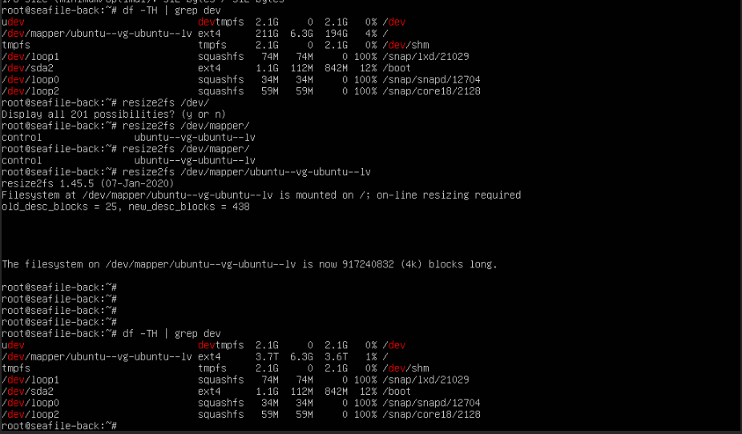

如果是创建系统给了3.7的空间，在创建完系统之后只有200G,需要如下进行处理

**扩展逻辑卷：**

- 使用`lvdisplay`命令查看逻辑卷的详细信息，确认卷组中是否有未分配的空间。
- 如果有未分配的空间，可以使用`lvextend`命令来扩展逻辑卷。例如，如果你的逻辑卷名为`lv_root`，并且有未分配的空间，你可以运行以下命令

```shell
lvextend -l +100%FREE /dev/mapper/vg_name-lv_root
```

lvextend -l +100%FREE /dev/mapper/vg_name-lv_root


**扩展文件系统：**

- 如果你成功扩展了逻辑卷，接下来需要扩展文件系统以使用新的空间。如果你使用的是ext4文件系统，可以使用`resize2fs`命令：

```shell
resize2fs /dev/mapper/vg_name-lv_root
```


如果你使用的是XFS文件系统，可以使用`xfs_growfs`命令：

```
xfs_growfs /dev/mapper/vg_name-lv_root
```





请注意，以上命令中的`vg_name`和`lv_root`可能需要根据你的实际情况进行替换。确保在执行任何涉及磁盘和分区操作的命令之前备份重要数据，以防万一发生意外。


