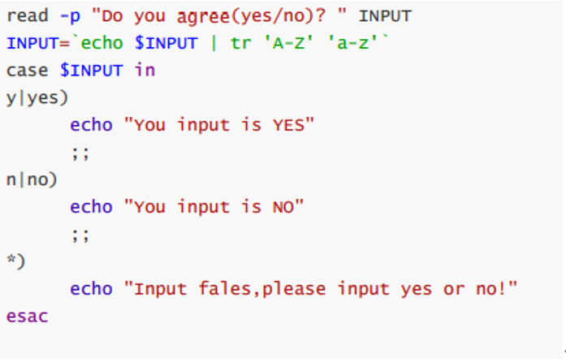
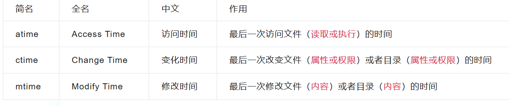
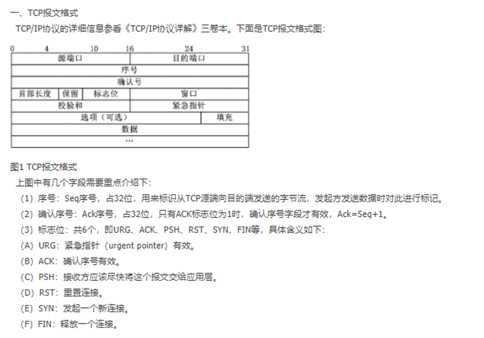
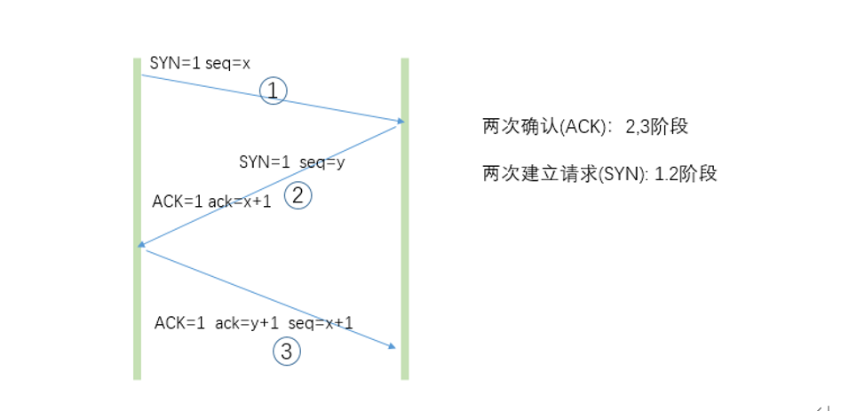
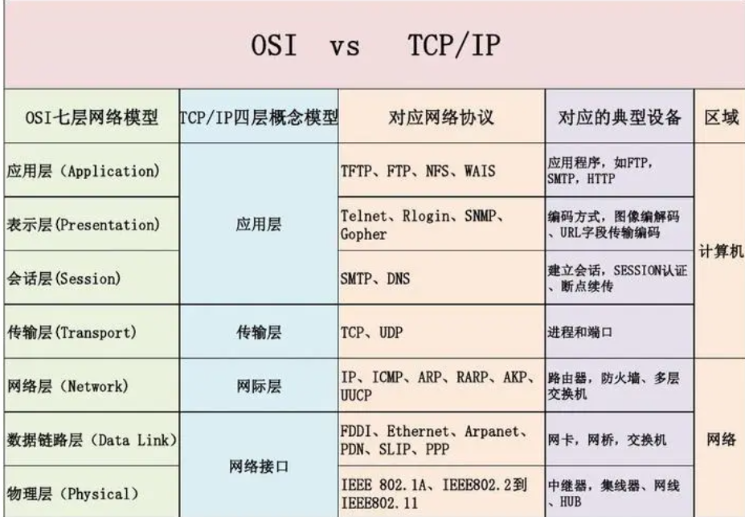
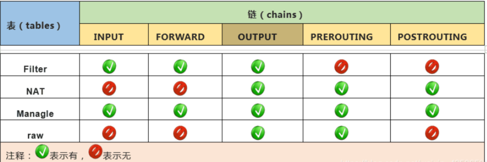

## shell脚本

变量引用

```shell
$name 或者 ${name}
```


命令引用: 

```shell
Name=`command` 或者 name =$(command)

查看变量 set 

删除变量: unset name 
```


环境变量: 

```shell
Export name=value 或者  declare -x name=value

查看环境变量; env ,printenv ,export,declare -x
```


只读变量: 只能申明定义，后续不能修改

```shell
Readonly name , declare -r name
```

 

参数

```shell
1、$#：表示执行脚本传入参数的个数

2、$*：表示执行脚本传入参数的列表（不包括$0）

3、$$：表示进程的id；Shell本身的PID（ProcessID，即脚本运行的当前 进程ID号）

4、$!：Shell最后运行的后台Process的PID(后台运行的最后一个进程的 进程ID号)

5、$@：表示执行脚本传入参数的所有个数（不包括$0）

6、$0：表示执行的脚本名称

7、$1：表示第一个参数

8、$2：表示第二个参数

9、$?：表示脚本执行的状态，0表示正常，其他表示错误
```


​      Set - - 清空所有的位置变量

退出状态码变量： 

​      $? 值为0 成功，  $? 1-255代表失败

​      \#生成 0 - 49 之间随机数 echo $[$RANDOM%50]

#随机字体颜色 [root@centos8 ~]#echo -e "\033[1;$[RANDOM%7+31]mmagedu\033[0m"

```txt
-gt 是否大于

-ge 是否大于等于

-eq 是否等于

-ne 是否不等于

-lt 是否小于

-le 是否小于等于

-z "STRING" 字符串是否为空，空为真，不空为假 

-n "STRING" 字符串是否不空，不空为真，空为假

\> ascii码是否大于ascii码

=~ 左侧字符串是否能够被右侧的PATTERN所匹配 注意: 此表达式用于[[ ]]中；扩展的正则表达式
```


**文件测试**

```txt
-a FILE：同 -e 

-e FILE: 文件存在性测试，存在为真，否则为假 

-b FILE：是否存在且为块设备文件 

-c FILE：是否存在且为字符设备文件 

-d FILE：是否存在且为目录文件 

-f FILE：是否存在且为普通文件 

-h FILE 或 -L FILE：存在且为符号链接文件 

-p FILE：是否存在且为命名管道文件 

-S FILE：是否存在且为套接字文件
```


配置文件执行顺序：

/etc/profile --> /etc/profile.d/*.sh --> ~/.bash_profile --> ~/.bashrc --> /etc/bashrc

 

profile类和bashrc类

profile类为交互式登录的shell提供配置 

全局：/etc/profile, /etc/profile.d/*.sh 

个人：~/.bash_profile

功用：

(1) 用于定义环境变量 

(2) 运行命令或脚本

 

Bashrc类

bashrc类：为非交互式和交互式登录的shell提供配置 

(1) 全局：/etc/bashrc

(2) 个人：~/.bashrc

功用： (1) 定义命令别名和函数 (2) 定义本地变量


条件判断case语句

```shell
case 变量引用 in

PAT1)

 分支1

 ;;

PAT2)

 分支2

 ;;

...

*)

 默认分支

 ;;

esac
```


 

\#返回字符串变量var的长度 ${#var}


## 日志清理

清理5天前日志

```shell
find ./* -mtime +5 -name "*.log.gz" -exec rm -f {} \;

查找当前目录下所有以.tar结尾的文件然后移动到指定目录：
find ./ -name "*.tar"  -exec mv {} ./backup;

查找当前目录30天以前大于100M的LOG文件并删除：
find ./ -name "*.log" -mtime +30 -type f -size  +100M|xargs rm -rf {};

```





## TCP/IP协议栈

#### 三次握手

https://www.cnblogs.com/dbhui/p/9596465.html








（1）第一次握手：Client将标志位SYN置为1，随机产生一个值seq=J，并将该数据包发送给Server，Client进入SYN_SENT状态，等待Server确认。

（2）第二次握手：Server收到数据包后由标志位SYN=1知道Client请求建立连接，Server将标志位SYN和ACK都置为1，ack=J+1，随机产生一个值seq=K，并将该数据包发送给Client以确认连接请求，Server进入SYN_RCVD状态。

（3）第三次握手：Client收到确认后，检查ack是否为J+1，ACK是否为1，如果正确则将标志位ACK置为1，ack=K+1，并将该数据包发送给Server，Server检查ack是否为K+1，ACK是否为1，如果正确则连接建立成功，Client和Server进入ESTABLISHED状态，完成三次握手，随后Client与Server之间可以开始传输数据了。

  SYN攻击：
   在三次握手过程中，Server发送SYN-ACK之后，收到Client的ACK之前的TCP连接称为半连接（half-open connect），此时Server处于SYN_RCVD状态，当收到ACK后，Server转入ESTABLISHED状态。SYN攻击就是Client在短时间内伪造大量不存在的IP地址，并向Server不断地发送SYN包，Server回复确认包，并等待Client的确认，由于源地址是不存在的，因此，Server需要不断重发直至超时，这些伪造的SYN包将产时间占用未连接队列，导致正常的SYN请求因为队列满而被丢弃，从而引起网络堵塞甚至[系统](http://www.2cto.com/os/)瘫痪。SYN攻击时一种典型的DDOS攻击，检测SYN攻击的方式非常简单，即当Server上有大量半连接状态且源IP地址是随机的，则可以断定遭到SYN攻击了，使用如下命令可以让之现行：

#netstat -nap | grep SYN_RECV


#### 四层握手的几种状态

待补充


##### 11种状态

##### prometheus中都有metrics监控,可以根据情况进行监控

```txt
LISTEN：等待从任何远端 TCP 和端口的连接请求

SYN_SENT：发送完一个连接请求后等待一个匹配的连接请求

SYN_RECEIVED：发送连接请求并且接收到匹配的连接请求以后等待连接请求确认

ESTABLISHED：表示一个打开的连接，接收到的数据可以被投递给用户。连接的数据传输阶段的正常状态

FIN_WAIT_1：等待远端 TCP 的连接终止请求，或者等待之前发送的连接终止请求的确认

FIN_WAIT_2：等待远端 TCP 的连接终止请求

CLOSE_WAIT：等待本地用户的连接终止请求

CLOSING：等待远端 TCP 的连接终止请求确认

LAST_ACK：等待先前发送给远端 TCP 的连接终止请求的确认（包括它字节的连接终止请求的确认）

TIME_WAIT：等待足够的时间过去以确保远端 TCP 接收到它的连接终止请求的确认
TIME_WAIT 两个存在的理由：
          1.可靠的实现 TCP 全双工连接的终止
          2.允许老的重复分节在网络中消逝

CLOSED：不在连接状态（这是为方便描述假想的状态，实际不存在）
```


## 路由交换

交换机： 涉及vlan，stp协议

路由器： static router,
       动态路由BGP,RIP，OSPF


介绍vxlan， vlan的区别，物理网络 underlay,  overlay叠加网络 

https://segmentfault.com/a/1190000022365692





## Raid,LVM服务器


Raid相关概念： 

 Raid0: 没有冗余，性能最好，冗余最差，2块起  磁盘使用率100%
 Raid1: 冗余最好， 但是性能最差 ，2块起，最多允许坏  磁盘使用率50%
 Raid5: 不管多少数据盘，最多只能坏一块盘。磁盘使用率(N-1)/N
 Raid10： 

1)  RAID 0+1是存储性能和数据安全兼顾的方案。它在提供与RAID 1一样的数据安全保障的同时，也提供了与RAID 0近似的存储性能。

2)  由于RAID 0+1也通过数据的100%备份提供数据安全保障，因此RAID 0+1的磁盘空间利用率与RAID 1相同，存储成本高。

3)  RAID 0+1的特点使其特别适用于既有大量数据需要存取，同时又对数据安全性要求严格的领域，如银行、金融、商业超市、仓储库房、各种档案管理等。


## KVM

 基本理论

什么是虚拟化？就是将一台物理机虚拟成多台虚拟机，虚拟机之前互不干扰。

为什么要用虚拟化？充分利用物理资源，提供冗余性、向云计算演进的必要基础。

常见的虚拟化软件？vmware、kvm

查看当前系统是使用哪家的虚拟化？lscpu

kvm的三个组件及作用：libvirt（用来管理虚拟机）、virt（安装和克隆虚拟机）、qemu（管理虚拟机磁盘的）

磁盘的类型（raw/qcow2），raw不支持快照但性能好，常用的是qcom2支持快照，性能相比差一点。

第一个虚拟要默认是侦听在5900这个端口。

桥接的工作原理


注意:

参考容器章节-比对kvm跟容器的区别


## iptables

表和链（四表五链）
1.filter （过滤） 进行包过滤处理的一张表
2.nat （映射） 对数据地址信息进行转换/数据包端口信息进行转换
实现内网用户访问外网
实现外网用户访问内网
3.mangle （不常用）
对数据包信息进行标记
4.raw（不常用





只允许远程主机访问本机的80端口

ptables  -P INPUT DROP

iptables -A INPUT --dport 80 -j ACCEPT


## mysql相关


一、MySQL5.6.16版本的主从复制搭建：
主机A IP：192.168.233.131
主机B IP：192.168.233.132
1）修改mysql的配置文件：
（1）开启二进制日志功能
（2）server-id = 1  //另外一台设置为2
2）在slave数据库上添加授权复制用户，在master数据库上进行授权：
create user 'repl'@'192.168.1.%' identified by 'your-password';
GRANT REPLICATION SLAVE ON *.* TO 'repl'@'192.168.1.%';
flush privileges;
3）在master数据库上执行`show master status;`命令：（查看）
mysql> show master status\G;
*************************** 1. row ***************************
File: mysql-master-bin.000005
Position: 120
Binlog_Do_DB:
Binlog_Ignore_DB:
Executed_Gtid_Set:
1 row in set (0.00 sec)
4）在slave数据库上执行：
mysql> change master to master_host='192.168.233.131', master_user='repl',master_password='your-password',master_auto_position=1;
Query OK, 0 rows affected, 2 warnings (0.24 sec)
mysql> start slave;
Query OK, 0 rows affected, 1 warning (0.04 sec)
5）在slave上执行`show slave status;`查看slave的状态：如果下面这俩个文件都为YES，则表示mysql主从复制搭建成功：
Slave_IO_Running: Yes
Slave_SQL_Running: Yes

二、mysql 主从不一致解决方法
方法一：忽略错误，同步
该方法适用于主从库数据相差不大，或者要求数据可以不完全统一的情况，数据要求不严格的情况
解决：
stop slave;
#表示跳过一步错误，后面的数字可变
set global sql_slave_skip_counter =1;
start slave;
之后再用mysql> show slave status\G  查看：
Slave_IO_Running: Yes
Slave_SQL_Running: Yes
ok，现在主从同步状态正常了。。。


## 安全审计

**分析业务需求和数据分类**：

- 与业务部门合作，了解哪些数据是敏感的，需要加密和保护。分类数据，以便知道如何处

- 参与安全审计和漏洞扫描，以发现和纠正潜在的安全问题
- 紧急响应：
  - 协助建立紧急响应计划，以应对数据泄露或其他安全事件
- 部署加密系统：
  - 协助信息安全团队部署加密系统，确保其正确运行。
  - 监控加密系统的性能和安全性，及时发现并应对潜在的问题。


## nginx


请解释Nginx服务器上的Master和Worker进程分别是什么?

Master进程：读取及评估配置和维持

Worker进程：处理请求


