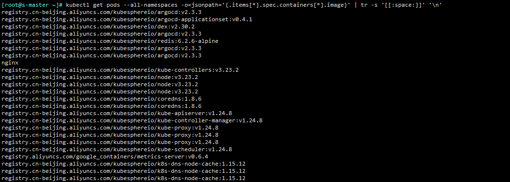
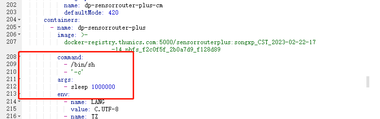

## 打印所有pod使用的镜像


##  清理k8s各个节点的镜像,需要验证

```shell
for i in `kubectl get nodes -o jsonpath='{range .items[*]}{.status.addresses[0].address}{"\n"}{end}' `; do
    ssh -i XXX USER@$i 'docker image prune -a -f'; exit 0
done
```

```shell
kubectl get nodes -o jsonpath='{range .items[*]}{.status.addresses[?(@.type=="InternalIP")].address}{"\n"}{end}'
```


## patch镜像

```shell
kubectl patch deployment itz-test-aaa   --patch '{"spec": {"template": {"spec": {"containers": [{"name": "tz-test-aaa-1","image":"harbor.zlqit.com/tz_aaa/tz-test-aaa:1.1.93"}]}}}}' -n  tz-aaa
```


## configmap热更新插件

https://github.com/stakater/Reloader


## 更新ingress-tls证书

https://iteshell.oss-cn-beijing.aliyuncs.com/bookshell/202401121030436.png

```shell
#获取ingress-对应的域名
kubectl  get ingress -A | grep file

#找到ingress之后，查看绑定的证书secret 
kubectl  get  ingress be-filesystem-api -n smart -o yaml | grep secretName

#创建证书-提前将证书上传到文件夹
kubectl  create secret tls be-filesystem-api-tls-20231123 --cert=filesystem-api.aaa.com_bundle.pem --key=filesystem-api.aaa.com.key  --dry-run=client -o yaml > be-filesystem-api-tls-20231123.yaml

#创建secret 
kubectl  apply -f fe-video-foundation-tls-20231123.yaml

#替换secret
kubectl  edit ingress be-filesystem-api -n smart
```


## kubernetes集群证书更新

```shell
# k8s证书自动续签 
0 12 1 4,8,12 * cp -rf /etc/kubernetes /etc/kubernetes.bak;kubeadm certs renew all;mv /etc/kubernetes/*.conf /tmp/;kubeadm init phase kubeconfig all;systemctl restart kubelet;cp /etc/kubernetes/admin.conf ~/.kube/config;docker ps | grep -v pause | grep -E "etcd|scheduler|controller|apiserver" | awk '{print $1}' | awk '{print "docker","restart",$1}' | bash
```


## 清理不正常的Pod

```shell
kubectl get pods --all-namespaces | grep Evicted| awk '{cmd=" kubectl delete pod "$2" -n "$1;system(cmd)}' 
```


## kubernetes中etcd备份方式

```shell
root@ekc10:/home/devops# cat /data/k8s/etcd_backup/etcd_backup.sh 
rm etcd_snap_save_$(date -d "10 days ago" +"%Y%m%d")*
/usr/local/bin/etcdctl --endpoints 127.0.0.1:2379 --cert=/etc/kubernetes/pki/etcd/server.crt --key=/etc/kubernetes/pki/etcd/server.key --cacert=/etc/kubernetes/pki/etcd/ca.crt snapshot save etcd_snap_save_$(date +"%Y%m%d%H%M").db
```


## 容器清理脚本

```shell
root@ekc10:/home/devops# cat /root/clear/clear_container.sh 
echo '---------------------------------------------------'
echo $(date)
cd /var/lib/docker/containers/
du -sh * | grep G
for m in $(du -sh * | grep G | awk -F' ' '{print $1":"$2}' | awk -F'G:' '{if ($1 > 5) print $2}')
do
  for i in $(docker ps -a | awk -F' ' '{print $1}')
  do
    docker inspect $i | grep $m && echo $(docker ps -a | grep $i)
    docker inspect $i | grep $m && echo $(docker ps -a | grep $i) | awk -F' ' '{print $1}' | xargs docker stop | xargs docker rm
  done
done
```


## 替换容器启动命令


​        command: ["/bin/sh", "-c"]        
​        args: ["sleep 1000000"]




## OOM问题

一般情况： Limit分配的资源不够用，导致Kubelet就自动杀掉了服务

  解决方式，调高limit限制，根据宿主机物理内存给


第二种情况： 物理内存不够用，本身limit就需要这些资源 

  解决方式： 更好资源充足的节点


## 自动化安装容器

```shell
###按照docker

#添加GPG key
curl -fsSL https://mirrors.tuna.tsinghua.edu.cn/docker-ce/linux/ubuntu/gpg | sudo apt-key add -

#验证指纹
sudo apt-key fingerprint 0EBFCD88

#添加docker-ce的仓库
sudo add-apt-repository \
   "deb [arch=amd64] https://mirrors.tuna.tsinghua.edu.cn/docker-ce/linux/ubuntu \
   $(lsb_release -cs) \
   stable"

#查看可以安装的版本
apt-cache madison docker 
apt install docker-ce=5:20.10.10~3-0~ubuntu-focal


###修改containerd配置
echo "[info] containerd is already installed"
docker_install_code=0
systemctl  stop ufw && systemctl  disable ufw
rm -f /etc/containerd/config.toml
mkdir -p /etc/containerd
containerd config default | tee /etc/containerd/config.toml

sed -i 's#SystemdCgroup = false#SystemdCgroup = true#' /etc/containerd/config.toml


sed -i 's@registry.k8s.io@registry.cn-hangzhou.aliyuncs.com/zlq_registry@'  /etc/containerd/config.toml

systemctl daemon-reload
systemctl restart containerd


apt-get update
wget https://github.com/kubernetes-sigs/cri-tools/releases/download/v1.23.0/crictl-v1.23.0-linux-amd64.tar.gz
tar zxvf crictl-v1.23.0-linux-amd64.tar.gz -C /usr/local/bin
cat > /etc/crictl.yaml <<EOF
runtime-endpoint: unix:///run/containerd/containerd.sock
image-endpoint: unix:///run/containerd/containerd.sock
timeout: 10
debug: false
EOF

docker run --name k8s-manager --net host --restart=always -v /root:/root -d   registry.cn-hangzhou.aliyuncs.com/zlq_registry/k8s-manager:v1.0
```


