## 1.集群部署

1.1、部署说明
生产机器建议配置：  最低 8C / 16 G 

三节点： 
10.51.8.120 
10.51.8.121
10.51.8.122
配置文件：


```shell
[root@es001 ~]# cat /usr/local/elasticsearch-8.2.0/config/elasticsearch.yml  | grep -v "#"
cluster.name: my-elasticsearch
node.name: es001   #每台机器只需要修改此处
network.host: 0.0.0.0
http.port: 9200
discovery.seed_hosts: ["10.51.8.120","10.51.8.121","10.51.8.122"]
#master选举最少的节点数，这个一定要设置为N/2+1，其中N是：具有master资格的节点的数量，而不是整个集群节点个数。
cluster.initial_master_nodes: ["10.51.8.120","10.51.8.121","10.51.8.122"]


xpack.security.enabled: false

xpack.security.enrollment.enabled: false

xpack.security.http.ssl:
  enabled: true
  keystore.path: certs/http.p12

xpack.security.transport.ssl:
  enabled: true
  verification_mode: certificate
  keystore.path: certs/transport.p12
  truststore.path: certs/transport.p12

http.host: 0.0.0.0

transport.host: 0.0.0.0

#每台机器需要添加
[root@es001 ~]# cat /etc/hosts
127.0.0.1   localhost localhost.localdomain localhost4 localhost4.localdomain4
10.51.8.121 es002
10.51.8.122 es003
10.51.8.120 es001
```
单节点启动集群：
说明： 守护进程方式启动： 
进入软件的安装目录，进入到bin
执行：sh elasticsearch -d -p pid

[es@es001 elasticsearch-8.2.0]$ ./bin/elasticsearch   
原因： 尚未发现或选择主节点，一次选择至少需要2个ID为的节点

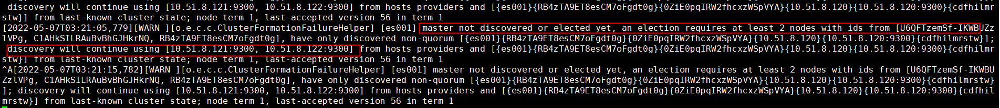


启动之后过一段时间报错：找不到节点
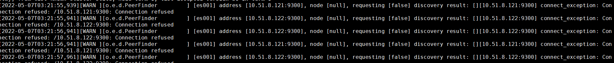
按照上面方式，首先但节点启动集群，如果其他节点没有启动，首先会有图1的提示，过一段时间会有图2提示连接不到节点。 

然后启动第二个节点
然后在节点1看日志，显示已经有一个节点加进来 ，显示主节点已更改，当前是es002

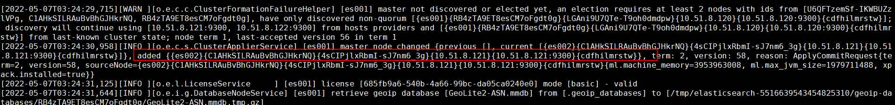
日志提示：

```shell
current.health="GREEN" message="Cluster health status changed from [YELLOW] to [GREEN] (reason: [shards started [[.geoip_databases][0]]])." previous.health="YELLOW" reason="shards started [[.geoip_databases][0]]"
```
现在的health=“GREEN”message=“群集运行状况从[黄色]更改为[绿色]（原因：[碎片已启动[.geoip_数据库][0]]）以前的health=“YELLOW”reason=“碎片已启动[.geoip_数据库][0]。”

然后在es003加入第三个节点： 
在es001上看到的日志
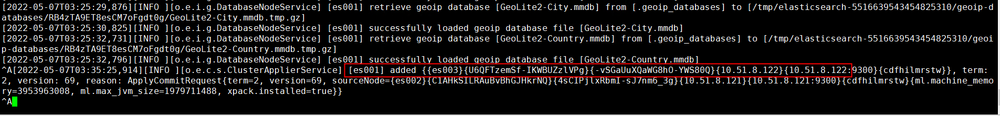
在es002上看到的日志

es002为主节点
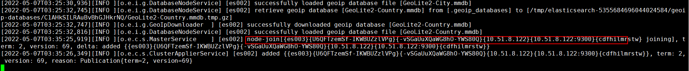
查看集群状态：
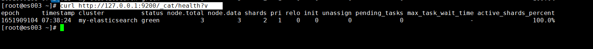
https://github.com/didi/LogiEM

分片在创建好，后期不能修改

GET /_cat/indices

1、创建数据库
创建数据库就是在es中创建索引，下面创建索引testdb 
向ES服务器发送PUT请求：  http://x.x.x.x:9200/testdb

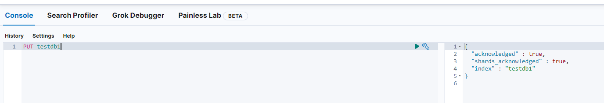
查看所有的索引：
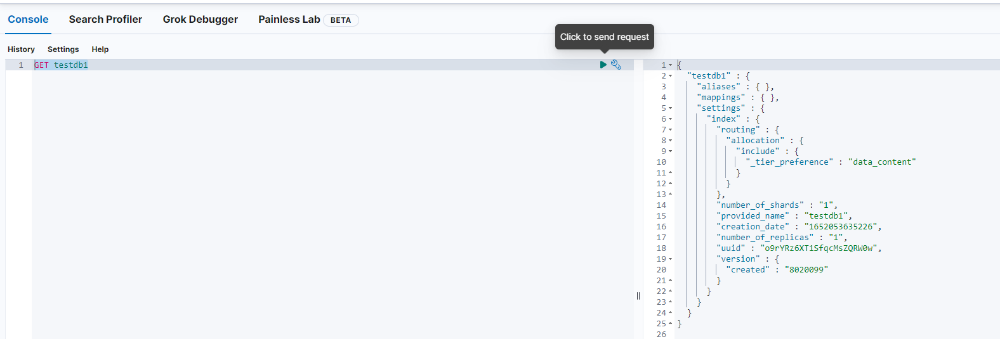''

删除索引：
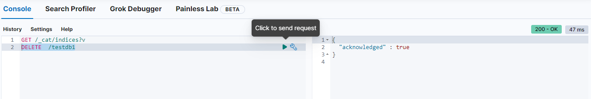

2、添加数据 doc  文档
在新版本中没有type概念，就是没有表的概念。 

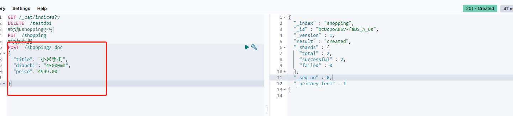

以上_id是自动生成的。也可以自定义，通过下面的方式。

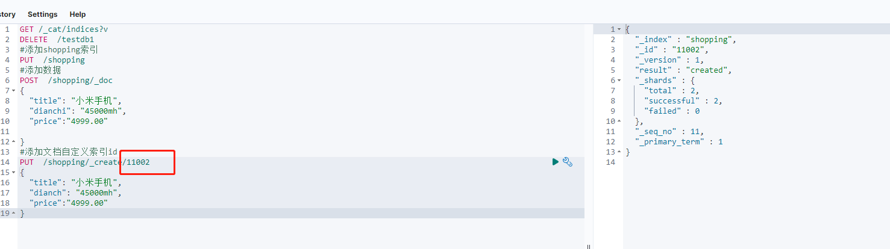
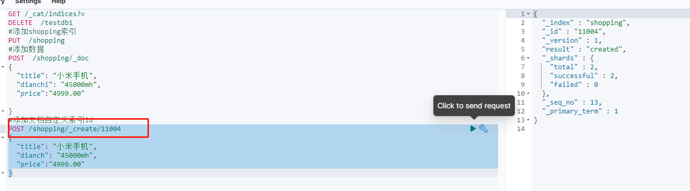
操作记录

```shell
GET /_cat/indices?v
DELETE  /testdb1
#添加shopping索引
PUT  /shopping
#添加数据
POST  /shopping/_doc
{
  "title": "小米手机",
  "dianchi": "45000mh",
  "price":"4999.00"
  
}
#添加文档自定义索引id
POST /shopping/_create/11004
{
  "title": "小米手机",
  "dianch": "45000mh",
  "price":"4999.00"
}
```

查询一条索引文档

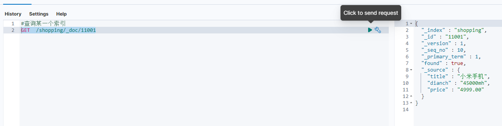

查询所有的索引文档
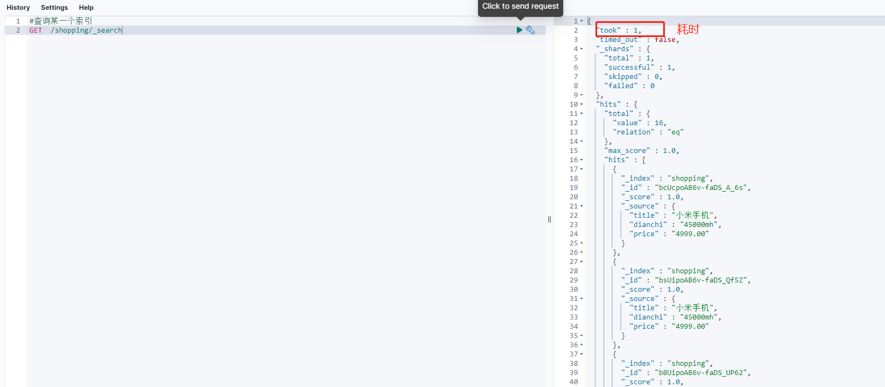
修改全部数据
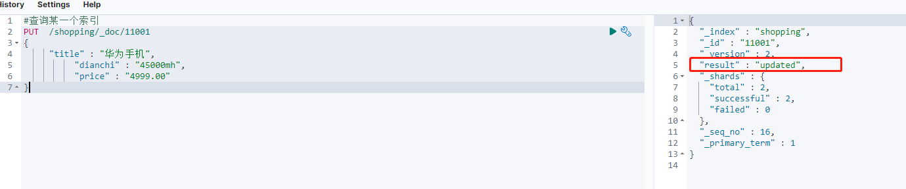
修改局部数据
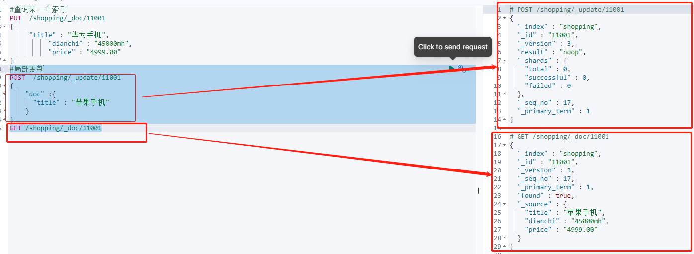

cur /_cat/nodes  #查看节点

es默认是一个分片，一个副本。

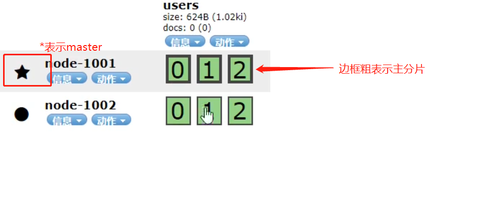
一些说明： 
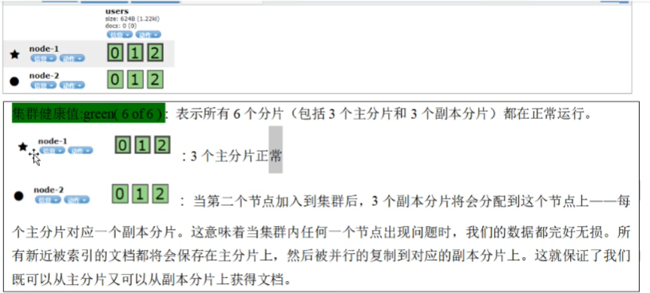
主分片在创建索引的时候已经定下来，后续没法修改，但是修改其副本，也可以提高访问量。 

PUT  /user/_settings 
{
   "number_of_replicas": 2 
}


当一个节点出现故障时，重启故障节点，一定要在配置文件中discover中添加集群节点信息，否则无法找到集群节点。