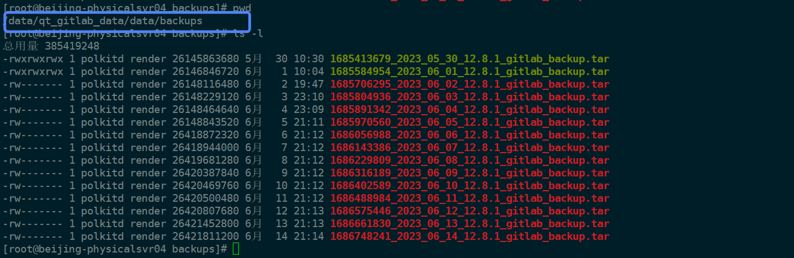
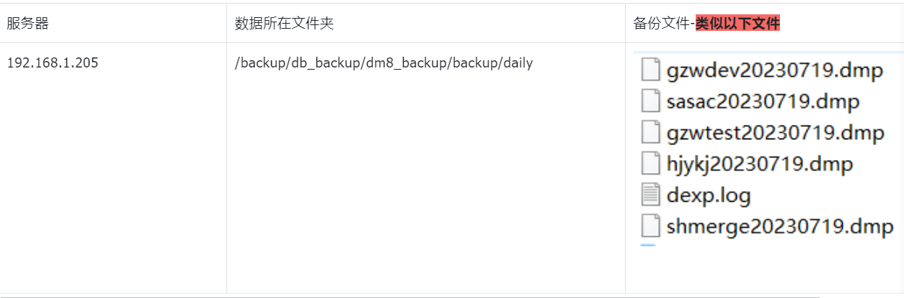
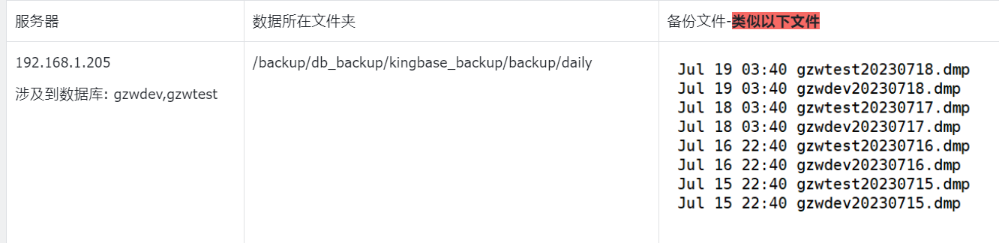
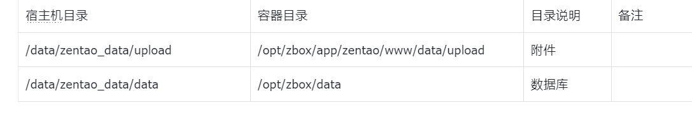
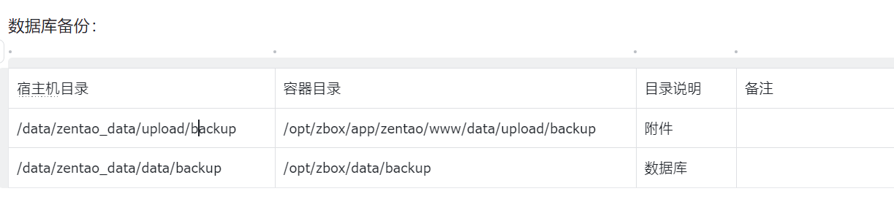

## 1、gitlab数据库

### 备份

机器IP 192.168.1.203
1.1 宿主机数据库目录
/data/qt_gitlab_data/data/backups

1.2 定时备份命令(宿主机crontab)
00 21 * * * docker exec -i 9a7b5170b200  sh /root/gitlabbak.sh  (切勿随意执行) 

1.3  容器中备份的脚本: 
```shell
[root@beijing-physicalsvr04 backup]# docker exec -i 9a7b5170b200  cat /root/gitlabbak.sh
gitlab-rake gitlab:backup:create
```





1.4 异地备份:
```shell
cd  /data/qt_gitlab_data/data/backups
```

备份最近的一天的数据包，比如备份像上面大的2023_06_14这天的tar包
说明： 由于备份文件比较大，需要使用xftp 工具备份即可

### 恢复


数据备份文件: 
盘阵服务器192.168.1.205:/backup/devops_backup/gitlab_backup
backups: 基于命令恢复的方式
{config,data,logs}: 基于备份文件恢复的方式-优先推荐此方式

基础镜像
```shell

192.168.1.207:18088/base/gitlab-ce:12.8.1-ce.0
192.168.1.203:18088/base/gitlab-ce:12.8.1-ce.0
```


创建文件夹
```shell
mkdir -p   /data/qt_gitlab_data/
```

移动备份文件
```shell
mv  /backup/devops_backup/gitlab_backup/*   /data/qt_gitlab_data/
```

部署服务

```shell
docker service create \
--hostname qtgit.qtlocal.atme.top \
--network devops \
--mount type=bind,src=/data/qt_gitlab_data/config,dst=/etc/gitlab \
--mount type=bind,src=/data/qt_gitlab_data/logs,dst=/var/log/gitlab \
--mount type=bind,src=/data/qt_gitlab_data/data,dst=/var/opt/gitlab \
--env GITLAB_OMNIBUS_CONFIG="external_url 'http://qtgit.qtlocal.atme.top:22280'; gitlab_rails['lfs_enabled'] = true;" \
--name qtgit \
--constraint 'node.labels.role == entry' \
--label traefik.enable=true \
--label traefik.http.routers.gitlab.rule="Host(\`qtgit.qtlocal.atme.top\`)" \
--label traefik.http.services.gitlab-service.loadbalancer.server.port=22280 \
 192.168.1.207:18088/base/gitlab-ce:12.8.1-ce.0
````


## 2.达梦数据库备份


### 备份

2.1 宿主机数据库目录
/data/dm8_data/backup

2.2定时备份命令(宿主机crontab)
```shell
宿主机定时命令:  00 20 * * * docker exec -i 66e3e7c87a32  sh /root/dm_crontab_bak.sh  (切勿随意执行) 
```
2.3  容器中备份的脚本: 
```shell
[root@beijing-physicalsvr04 backup]# docker exec -i 66e3e7c87a32  cat  /root/dm_crontab_bak.sh
#!/bin/bash
cd /opt/dmdbms/bin/
backup_date=`date +%Y%m%d`
./dexp gzwdev/gzwdev2023@localhost:5236 FILE=gzwdev$backup_date.dmp LOG=gzwdev$backup_date.log DIRECTORY=/opt/dmdbms/data/backup/ >/dev/null 2>&1
./dexp sasac/sasac2023@localhost:5236 FILE=sasac$backup_date.dmp LOG=sasac$backup_date.log DIRECTORY=/opt/dmdbms/data/backup/ >/dev/null 2>&1
./dexp shdb/shanghai2023@localhost:5236 FILE=shdb$backup_date.dmp LOG=shdb$backup_date.log DIRECTORY=/opt/dmdbms/data/backup/ >/dev/null 2>&1
./dexp gzwtest/gzwtest2023@localhost:5236 FILE=gzwtest$backup_date.dmp LOG=gzwtest$backup_date.log DIRECTORY=/opt/dmdbms/data/backup/ >/dev/null 2>&1
./dexp hjykj/hjykj2023@localhost:5236 FILE=hjykj$backup_date.dmp LOG=hjykj$backup_date.log DIRECTORY=/opt/dmdbms/data/backup/ >/dev/null 2>&1
./dexp shmerge/shmerge2023@localhost:5236 FILE=shmerge$backup_date.dmp LOG=shmerge$backup_date.log DIRECTORY=/opt/dmdbms/data/backup/ >/dev/null 2>&1
```


2.4 异地备份:
```shell
1.导出最近一次数据备份文件
cd /data/dm8_data/backup
ls -lrt | grep -E  "gzwde|sasac|shdb|gzwtest|hjykj|shmerge" | awk '{print $NF}' | tail -n 14 > td.txt
```

2.创建临目录(第一次需要，后续可以省略)
mkdir tmp

3. 移动备份文件到临时目录

```shell
for i in `cat td.txt `; do mv $i ./tmp/ ; done
```

4. 打开ftp备份下面目录的数据

```shell
/data/pg_data/data/backup/tmp
```

5.把临时备份数据还原到原来的数据目录
```shell
mv ./tmp/*  .
```

### 恢复

2.1 容器恢复验证方式
镜像
dm8_single:v8.1.2.128_ent_x86_64_ctm_pack4
192.168.1.203:18088/base/dm8_single:v8.1.2.128_ent_x86_64_ctm_pack4
192.168.1.207:18088/base/dm8_single:v8.1.2.128_ent_x86_64_ctm_pack4

创建方式-研发环境部署方式
将备份的数据放到对应的目录
服务器: 192.168.1.205:/backup/db_backup/dm8_backup/backup/daily

6.1.1 在需要恢复的服务器创建文件夹
```shell
mkdir -p  /data/dm8_data
```

6.1.2 复制备份文件到对应的数据目录,假如 shmerge20230709.dmp 是最近一次的备份
上传xxx.dmp文件到   /root/

6.1.3 使用docker部署服务
#初始化
```shell
docker run -d -p 5236:5236  --name dm8  -e CASE_SENSITIVE=0 -v /data/dm8_data/:/opt/dmdbms/data/  192.168.1.203:18088/base/dm8_single:v8.1.2.128_ent_x86_64_ctm_pack4
#CASE_SENSITIVE不区分大小写
```

6.1.4 导入数据-取最近一次最新的备份数据
服务器
数据所在文件夹
备份文件-类似以下文件
192.168.1.205
/backup/db_backup/dm8_backup/backup/daily




6.1.5 拷贝文件到容器
```shell
docker cp gzwdev20230719.dmp    dm8:/dm8/dexp/
docker cp gzwtest20230719.dmp  dm8:/dm8/dexp/
docker cp hjykj20230719.dmp     dm8:/dm8/dexp/
docker cp sasac20230719.dmp     dm8:/dm8/dexp/
docker cp shmerge20230719.dmp   dm8:/dm8/dexp/
```

6.1.6 配置变量
```shell
docker exec -it dm8 bash
vi /etc/profile

DM_HOME=/opt/dmdbms/
export PATH=$PATH:$DM_HOME/bin
export LD_LIBRARY_PATH=$LD_LIBRARY_PATH:$DM_HOME/bin
source  /etc/profile 
```

6.1.7 通过dm客户端连接数据，然创建相关用户
```shell
create user gzwdev  identified by gzwdev2023;
grant dba to gzwdev;

create user gzwtest  identified by gzwtest2023;
grant dba to gzwtest;

create user hjykj  identified by hjykj2023;
grant dba to hjykj;

create user sasac  identified by sasac2023;
grant dba to sasac;

create user shmerge  identified by  shmerge2023;
grant dba to shmerge;
```

6.1.8 然后在容器中导入数据即可
```shell
dimp  gzwdev/gzwdev2023  directory=/dm8/dexp   file=gzwdev20230719.dmp      full=y  log=gzwdev.log 
dimp  gzwtest/gzwtest2023  directory=/dm8/dexp   file=gzwtest20230719.dmp   full=y  log=gzwtest.log
dimp  hjykj/hjykj2023  directory=/dm8/dexp   file=hjykj20230719.dmp         full=y  log=hjykj.log
dimp  sasac/sasac2023  directory=/dm8/dexp   file=sasac20230719.dmp         full=y  log=sasac.log
dimp  shmerge/shmerge2023  directory=/dm8/dexp   file=shmerge20230719.dmp   full=y  log=shmerge.log
```


## 3、pgsql数据库


### 备份

3.1 宿主机备份目录
/data/pg_data/data/backup

3.2 定时备份命令(宿主机crontab)：
```shell
宿主机定时命令:   
10 2 * * * docker exec -i 31fdb4cbe63f  sh /root/pgsql_crontab_bak_day.sh
00 2 * * 7 docker exec -i 31fdb4cbe63f  sh /root/pgsql_crontab_bak_week.sh
50 2 30 * * docker exec -i 31fdb4cbe63f  sh /root/pgsql_crontab_bak_month.sh
 (切勿随意执行)
```

3.3  容器中备份的脚本: 
```shell
root@31fdb4cbe63f:~# cat pgsql_crontab_bak_day.sh 
#!/bin/bash
#cd /opt/dmdbms/bin/
backup_date=`date +%Y%m%d`
pg_dump  -U postgres -c  crhc_investment -f   /var/lib/postgresql/data/backup/daily/crhc_investment$backup_date.sql
pg_dump  -U postgres -c toptang  -f   /var/lib/postgresql/data/backup/daily/toptang$backup_date.sql
root@31fdb4cbe63f:~# cat pgsql_crontab_bak_week.sh 
#!/bin/bash
#cd /opt/dmdbms/bin/
backup_date=`date +%Y%m%d`
pg_dump  -U postgres -c dev_hebei_cq  -f   /var/lib/postgresql/data/backup/weekly/dev_hebei_cq$backup_date.sql
pg_dump  -U postgres -c dome_gyjtcq  -f   /var/lib/postgresql/data/backup/weekly/dome_gyjtcq$backup_date.sql
pg_dump  -U postgres -c test_gzwgh  -f   /var/lib/postgresql/data/backup/weekly/test_gzwgh$backup_date.sql
pg_dump  -U postgres -c test_hbfz  -f   /var/lib/postgresql/data/backup/weekly/test_hbfz$backup_date.sql
pg_dump  -U postgres -c test_henan_cq  -f   /var/lib/postgresql/data/backup/weekly/test_henan_cq$backup_date.sql
pg_dump  -U postgres -c test_hljcqdb  -f   /var/lib/postgresql/data/backup/weekly/test_hljcqdb$backup_date.sql
pg_dump  -U postgres -c test_hndb  -f   /var/lib/postgresql/data/backup/weekly/test_hndb$backup_date.sql
pg_dump  -U postgres -c fanruanReport  -f   /var/lib/postgresql/data/backup/weekly/fanruanReport$backup_date.sql
root@31fdb4cbe63f:~# cat pgsql_crontab_bak_month.sh 
#!/bin/bash
#cd /opt/dmdbms/bin/
backup_date=`date +%Y%m%d`
pg_dump  -U postgres -c test_hebei_cq  -f   /var/lib/postgresql/data/backup/monthly/test_hebei_cq$backup_date.sql
pg_dump  -U postgres -c test_hlj_tz  -f   /var/lib/postgresql/data/backup/monthly/test_hlj_tz$backup_date.sql
pg_dump  -U postgres -c test_lncq_cq  -f   /var/lib/postgresql/data/backup/monthly/test_lncq_cq$backup_date.sql
```

3.4 异地备份:
1. 导出最近一次数据备份文件

```shell
cd /data/pg_data/data/backup
ls -lrt | grep -E  "crhc_investment|dev_hebei_cq|dev_hlj_tz|dev_hndb|dome_gyjtcq|test_gzwgh|test_hbfz|test_hebei_cq|test_henan_cq|test_hlj_tz|test_hljcqdb|test_hndb|toptang|fanruanReport" | awk '{print $NF}' | tail -n 14 > db.txt
```

2.创建临目录(第一次需要，后续可以省略)
```shell
mkdir tmp
```

3. 移动备份文件到临时目录

```shell
for i in `cat td.txt `; do mv $i ./tmp/ ; done
```

4. 打开ftp备份下面目录的数据

```shell
/data/pg_data/data/backup/tmp
```

5.把临时备份数据还原到原来的数据目录
```shell
mv ./tmp/*  .
```

### 恢复

3.5 容器恢复验证及数据恢复验证
/backup/db_backup/pgsql_backup/此目录为数据持久化目录及数据备份目录

3.5.1、拉取postgresql的镜像及服务启动
docker pull 192.168.1.203:18088/git/postgres:13.2

#将数据持久化目录/backup/db_backup/pgsql_backup/往服务器上cp一份然后用于数据持久化目录进行启动容器
```shell
docker run -dit -p 5432:5432 --restart=always -v /data/pgsql_data/data/:/var/lib/postgresql/data/ --name pgsql 192.168.1.203:18088/git/postgres:13.2
```
3.5.2、数据集恢复命令如下

1)、创建数据库实例
```shell
create database test_henan_cq;
create database test_hljcqdb;
create database dev_hebei_cq;
create database test_hebei_cq;
create database test_hlj_tz;
create database test_gzwgh;
create database dome_gyjtcq;
create database test_hndb;
create database test_hbfz;
create database test_lncq_cq;
create database crhc_investment;
create database fanruanReport;
create database toptang;
```

2)、数据导入
```shell
psql  -d  test_henan_cq -f  /var/lib/postgresql/backup/weekly/test_henan_cq20230729.sql postgres
psql  -d  test_hljcqdb -f  /var/lib/postgresql/backup/weekly/test_hljcqdb20230729.sql postgres
psql  -d  dev_hebei_cq -f  /var/lib/postgresql/backup/weekly/dev_hebei_cq20230729.sql postgres
psql  -d  test_hebei_cq -f  /var/lib/postgresql/backup/monthly/test_hebei_cq20230729.sql postgres
psql  -d  test_hlj_tz -f  /var/lib/postgresql/backup/monthly/test_hlj_tz20230729.sql postgres
psql  -d  test_gzwgh -f  /var/lib/postgresql/backup/weekly/test_gzwgh20230729.sql postgres
psql  -d  dome_gyjtcq -f  /var/lib/postgresql/backup/weekly/dome_gyjtcq20230729.sql postgres
psql  -d  test_hndb -f  /var/lib/postgresql/backup/weekly/test_hndb20230729.sql postgres
psql  -d  test_hbfz -f  /var/lib/postgresql/backup/weekly/test_hhbfz20230729.sql postgres
psql  -d  test_lncq_cq -f  /var/lib/postgresql/backup/monthly/test_lncq_cq20230729.sql postgres
psql  -d  crhc_investment -f  /var/lib/postgresql/backup/daily/crhc_investment20230729.sql postgres
psql  -d  fanruanReport -f  /var/lib/postgresql/backup/weekly/fanruanReport20230729.sql postgres
psql  -d  toptang -f  /var/lib/postgresql/backup/daily/toptang20230729.sql postgres

```

使用navicat登录上之后检查各数据库服务的数据是否正常即可;


## 4、金仓数据库

### 备份

4.1 宿主机备份目录
/data/kingbase_data/backup

4.2 定时备份命令(宿主机crontab)：
宿主机定时命令:   
```shell
30 20 * * * docker exec -i 238b7890f4ec  sh /root/kingbase_crontab_bak.sh   (切勿随意执行) 
```

4.3  容器中备份的脚本: 
```shell
[root@beijing-physicalsvr04 backup]# docker exec -i 238b7890f4ec  cat /root/kingbase_crontab_bak.sh
#!/bin/bash
cd /home/test/KingbaseES/bin/
backup_date=`date +%Y%m%d`
./sys_dump -h 127.0.0.1 -p 54321 -U gzwdev -W gzwdev2023 -F c -f /home/kingbase/ES/V8/data/backup/gzwdev$backup_date.dmp gzwdev
./sys_dump -h 127.0.0.1 -p 54321 -U gzwtest -W gzwtest2023 -F c -f /home/kingbase/ES/V8/data/backup/gzwtest$backup_date.dmp gzwtest
./sys_dump -h 127.0.0.1 -p 54321 -U jsgzw -W jsgzw2023 -F c -f /home/kingbase/ES/V8/data/backup/jsgzw$backup_date.dmp jscqxt
```

4.4 异地备份:
1.导出最近一次数据备份文件
```shell
cd /data/kingbase_data/backup
ls -lrt | grep -E  "gzwdev2023|gzwtest2023|jsgzw2023" | awk '{print $NF}' | tail -n 3 >td.txt
```

2.创建临目录(第一次需要，后续可以省略)

mkdir tmp

3.移动备份文件到临时目录

```shell
for i in `cat td.txt `; do mv $i ./tmp/ ; done
```

4.打开ftp备份数据

5.把临时备份数据还原到原来的数据目录
```shell
mv ./tmp/*  .
```

### 恢复


容器恢复验证方式

老镜像-不推荐使用
kdb_case_sensitive_centos7.5_x86_64_v8r3c02b0370:v1
192.168.1.203:18088/base/kdb_case_sensitive_centos7.5_x86_64_v8r3c02b0370:v1
192.168.1.207:18088/base/kdb_case_sensitive_centos7.5_x86_64_v8r3c02b0370:v1

新创建的镜像-使用此镜像
192.168.1.203:18088/base/kdb_case_sensitive_centos7.5_x86_64_v8r3c02b0370:v2
192.168.1.207:18088/base/kdb_case_sensitive_centos7.5_x86_64_v8r3c02b0370:v2


创建方式-研发环境部署方式
将备份的数据放到对应的目录
服务器: 192.168.1.205:/backup/db_backup/kingbase_backup/backup/daily

4.1.1 在需要恢复的服务器创建文件夹
mkdir -p  /data/kingbase_data
4.1.2 复制备份文件到对应的数据目录,假如 shmerge20230709.dmp 是最近一次的备份
上传xxx.dmp文件到  /data/kingbase_data

4.1.3 创建容器，但不需要挂载
#初始化
docker run  -p 54321:54321  --name kingbasev8r3 \
192.168.1.203:18088/base/kdb_case_sensitive_centos7.5_x86_64_v8r3c02b0370:v2
#CASE_SENSITIVE不区分大小写

4.1.4 导入数据-取最近一次最新的备份数据
服务器
数据所在文件夹
备份文件-类似以下文件
192.168.1.205
涉及到数据库: gzwdev,gzwtest
/backup/db_backup/kingbase_backup/backup/daily




4.1.5 拷贝数据库文件系统到宿主机
```shell
cd   /data/kingbase_data
docker cp kingbasev8r3:/home/test/data .
chmod -R 700 /data/kingbase_data/data
docker rm -f kingbasev8r3

docker run  -d -p 54321:54321  --name kingbasev8r3 \
-v  /data/kingbase_data/data:/home/test/data/ \
192.168.1.203:18088/base/kdb_case_sensitive_centos7.5_x86_64_v8r3c02b0370:v2
```


4.1.6 查询是否不区分大小写
```shell
docker exec -it kingbasev8r3 bash
cd /home/test/KingbaseES/bin
./ksql -d TEST -U SYSTEM -W 123456
TEST=# show case_sensitive;
 case_sensitive 
----------------
 off
(1 row)

```

4.1.7  登录数据库-恢复数据
```shell
默认用户/密码：SYSTEM/123456
cd /home/test/KingbaseES/bin
./ksql -d TEST -U SYSTEM -W 123456

-- 创建gzwdev用户
CREATE USER gzwdev  PASSWORD 'gzwdev2023';
-- 创建gzwdev库
CREATE DATABASE gzwdev WITH OWNER = "gzwdev" ENCODING UTF8;
-- 创建schema
create schema %s

-- 创建gzwtest用户
CREATE USER gzwtest  PASSWORD 'gzwtest2023';
-- 创建gzwtest库
CREATE DATABASE gzwtest WITH OWNER = "gzwtest" ENCODING UTF8;
-- 创建schema
create schema %s
```

4.1.8 将逻辑备份文件导入容器中，指定目录为/root
```shell
docker cp gzwdev20230719.dmp kingbasev8r3:/root/
docker cp gzwtest20230719.dmp  kingbasev8r3:/root
```

4.1.9 进行数据恢复
```shell
docker exec -it kingbasev8r3 bash
cd /home/test/KingbaseES/bin
导入数据，输入system用户名密码
[root@2a866ef87f59 bin]# ./sys_restore   -Fc /root/gzwdev20230719.dmp  -Usystem  -dgzwdev
Password: 
[root@2a866ef87f59 bin]# ./sys_restore   -Fc /root/gzwtest20230719.dmp   -Usystem  -dgzwtest
Password:
```
登录验证， 使用客户端登录验证即可


## 5、Oracle

### 备份

5.1 宿主机备份目录
192.168.1.203:/data/oracle11g_data/helowin/backup

5.2 定时备份命令(宿主机crontab)：
宿主机定时命令:
```shell
45 20 * * * docker exec -i 320df33197e2  sh /home/oracle/oracle11g_crontab_bak.sh  (切勿随意执行) 
```

5.3  容器中备份的脚本: 
```shell
[root@beijing-physicalsvr04 backup]# docker exec -i 320df33197e2  cat /home/oracle/oracle11g_crontab_bak.sh
#!/bin/bash
source /etc/profile
backup_date=`date +%Y%m%d`
expdp test_yx/test_yx_cq2023_#@127.0.0.1:1521/helowin directory=datapump_bak dumpfile=yxcq$backup_date.dmp
expdp test_salt/test_salt_tz2023_#@127.0.0.1:1521/helowin directory=datapump_bak dumpfile=salt$backup_date.dmp
expdp test_cnacg_investment/test_cnacg_investment_2023_#@127.0.0.1:1521/helowin directory=datapump_bak dumpfile=cnacg$backup_date.dmp
```

5.4 异地备份:
1.导出最近一次数据备份文件
```shell
cd /data/oracle11g_data/helowin/backup
ls -lrt | grep -E  "yxcq|salt|cnacg" | awk '{print $NF}' | tail -n 3  > td.txt
```

2.创建临目录(第一次需要，后续可以省略)
mkdir tmp

3. 移动备份文件到临时目录

```shell
for i in `cat td.txt `; do mv $i ./tmp/ ; done
```

4.打开ftp备份数据

5.把临时备份数据还原到原来的数据目录

```shell
mv ./tmp/*  .
```

备份镜像地址:  
   192.168.1.203:18088/base/oracle_11g:latest
   192.168.1.207:18088/base/oracle_11g:latest


### 恢复


## 6、禅道备份

### 备份


6.1 宿主机备份目录
创建容器绑定目录:


数据库备份：



6.2 定时备份命令(宿主机crontab)：
宿主机定时命令:   
30 6 * * * docker exec -i a9e91a450b1d sh /root/zentao_db_bak.sh
40 6 * * * docker exec -i a9e91a450b1d sh /root/clean_sql.sh
41 6 * * * docker exec -i a9e91a450b1d sh /root/clean_upload.sh

6.3  容器中备份的脚本zentao_db_bak.sh
```shell
[root@beijing-physicalsvr04 data]# docker exec -i 7f71ec8126dc   cat /root/zentao_db_bak.sh
#!/bin/bash
source /etc/profile
backup_date=`date +%Y%m%d`
BACK_DIR="/opt/zbox/data/backup"
/opt/zbox/run/mysql/mysqldump  -uroot -h127.0.0.1 -p$PASS  --databases zentao  > ${BACK_DIR}/zentao_db_bak_${backup_date}.sql
/opt/zbox/run/mysql/mysqldump  -uroot -h127.0.0.1 -p$PASS  --databases zentaoep  >  ${BACK_DIR}/zentaoep_db_bak_${backup_date}.sql
/opt/zbox/run/mysql/mysqldump  -uroot -h127.0.0.1 -p$PASS  --databases zentaopro  > ${BACK_DIR}/zentaopro_db_bak_${backup_date}.sql

###upload backup
backup_date=`date +%Y%m%d%M`
upload_dir="/opt/zbox/app/zentao/www/data/upload"
cd ${upload_dir}
tar -zcf  ./backup/upload_bak_${backup_date}.tar.gz  --exclude="backup"  ./*
```

数据库备份历史版本和附件保留脚本样例:
back_dir="/opt/zbox/data/backup/"     sql备份目录
back_dir="/opt/zbox/app/zentao/www/data/upload/backup"  upload备份目录
```shell
[root@a9e91a450b1d ~]# cat clean_backup.sh  
#!/bin/bash 
#此脚本用来定时备份jenkins_home数据 备份数据存放在/usr/local/jenkins_backup/下
FILE_NAME="zentao_backup"
COLOR='echo -e \E[01;32m'
END='\E[0m'
back_dir="/opt/zbox/data/backup/"
id_num="9"   ###定义当前保留的版本
cd $data_dir 
ls -lt $back_dir/  | grep -v total | awk '{print $9}' | head -n 4


all_file_num=`ls -lt $back_dir/  | grep -v total | awk '{print $9}' | wc | awk '{print $1}'`
rm_list(){
if [ $all_file_num -gt ${id_num} ]; then 
    a=0
    b=0
    c=0
    t=0
    flag=0
    declare -a file_prune_list

    for list in `ls -lt $back_dir/  | grep -v total | awk '{print $9}'` ; do
      all_file_list[$a]=$list
      a=$[a+1]
    done    


    #需要保存的历史版本
    for  list in `ls -lt $back_dir/  | grep -v total | awk '{print $9}' | head -n ${id_num}`; do
      save_file_list[$b]=$list 
      b=$[b+1]
    done 

    #将两组文件存入到数组
    arry_list1=${all_file_list[@]}
    arry_list2=${save_file_list[@]}

    for list1_num in "${all_file_list[@]}"
    do 
       for list2_num in "${save_file_list[@]}"
       do 
           if [[ "${list1_num}" == "${list2_num}" ]]; then 
               flag=1
               break 
           fi
       done 
       if [[ $flag -eq 0 ]]; then 
          file_prune_list[t]=$list1_num
          t=$((t+1))
       else
          flag=0 
       fi     
    done  


else    
  echo "################### 当前文件 ${FILE_NAME} 历史版本小于${id_num}个  #####################"
  exit

fi

for i in "${file_prune_list[@]}"; do 
     rm -f $back_dir/$i   
    echo "################## 删除文件  ${FILE_NAME} 历史版本 $i #####################"
done 
}
rm_list

```

6.4 异地备份-手动:
导出附件
1.导出最近一次数据备份文件
```shell
cd  /data/zentao_data/upload/backup
ls -lrt | grep -E  "upload_bak" | awk '{print $NF}' | tail -n 1  > td.txt
```

2.创建临目录(第一次需要，后续可以省略)
mkdir tmp

3.移动备份文件到临时目录
```shell
for i in `cat td.txt `; do mv $i ./tmp/ ; done
```

4.打开ftp备份数据

5.把临时备份数据还原到原来的数据目录
mv ./tmp/*  .

导出数据库
1.导出最近一次数据备份文件
```shell
cd  /data/zentao_data/data/backup
ls -lrt | grep -E  "zentao_db_bak" | awk '{print $NF}' | tail -n 1  > td.txt
```

2.创建临目录(第一次需要，后续可以省略)
mkdir tmp

3.移动备份文件到临时目录

```shell
for i in `cat td.txt `; do mv $i ./tmp/ ; done
```
4.打开ftp备份数据

5.把临时备份数据还原到原来的数据目录
mv ./tmp/*  .

6.5 数据同步-rsync同步
主机
原数据目录
目标目录
192.168.1.203
/data/zentao_data/
192.168.1.205
/backup/devops_backup/zentao_backup/


### 恢复

6.1 容器恢复验证
镜像
registry.qt.atme.top:8200/zentao/zentao:v1.0
192.168.1.203:18088/base/zentao:v1.0
192.168.1.207:18088/base/zentao:v1.0

创建方式-研发环境部署方式
将备份的数据放到对应的目录
服务器: 192.168.1.205:/backup/devops_backup/zentao_backup

6.1.1 创建文件夹
```shell
mkdir -p  /data/zentao_data/data
mkdir -p  /data/zentao_data/upload
```

6.1.2 复制备份文件到对应的数据目录,upload_bak_2023062530.tar.gz是最近一次的备份
```shell
tar xf  upload_bak_2023062530.tar.gz -C /data/zentao_data/upload
tar xf  mysql.tar      /data/zentao_data/data   ##后面进行增量数据导入
```

6.1.3 使用service部署服务
```shell
docker service create --name zentao \
--network devops \ 
--constraint 'node.labels.role == entry' \
--mount type=bind,src=/etc/localtime,dst=/etc/localtime \
--mount type=bind,src=/data/zentao_data/data,dst=/opt/zbox/data \
--mount type=bind,src=/data/zentao_data/upload,dst=/opt/zbox/app/zentao/www/data/upload \
registry.qt.atme.top:8200/zentao/zentao:v1.0
```

6.1.4 导入数据
```shell
docker exec -it  xxxxx bash
/opt/zbox/run/mysql/mysql  -h127.0.0.1 -p123456
MariaDB [zentao]> source /root/zentao_db_bak_20230718.sql
```

容器方式
参考以上6.1.1-6.1.2, 6.1.4

```shell
docker run  -p 1080:80 --name zentao \
--mount type=bind,src=/etc/localtime,dst=/etc/localtime \
--mount type=bind,src=/data/zentao_data/data,dst=/opt/zbox/data \
--mount type=bind,src=/data/zentao_data/upload,dst=/opt/zbox/app/zentao/www/data/upload \
192.168.1.203:18088/base/zentao:v1.0
[root@demo112 data]# docker exec -it zentao bash
```


## 7、jenkins数据备份


### 备份


说明： 由于数据比较大，大约40G左右，目前只保留两个历史版本，数据备份为2天备份一次
备份日期为: 周一，周三，周五，周日。凌晨00:05
服务器地址: 192.168.1.204
[root@beijing-virtualsvr01 script]# crontab  -l 
5 00 * * 1,3,5,7 bash /opt/script/jenkins_home_backup.sh

备份脚本
```shell
[root@beijing-virtualsvr01 script]# cat /opt/script/jenkins_home_backup.sh 
#!/usr/bin/bash
#此脚本用来定时备份jenkins_home数据 备份数据存放在/data/jenkins/jenkins_backup下
FILE_NAME="jenkins_home_databack"
datetime=`date '+%Y%m%d%H%M%S'`
data_dir="/data/jenkins/.jenkins"
back_dir="/data/jenkins/jenkins_backup"
log_dir="/var/log"
COLOR='echo -e \E[01;32m'
END='\E[0m'
$COLOR"########此脚本用来定时备份jenkins_home数据 备份数据存放在${back_dir}下########"  $END 
echo "[INFO] ###############`date +%Y-%m-%d_%H:%M:%S`###############" >> ${log_dir}/logout.log
echo "[INFO] `date +%Y-%m-%d_%H:%M:%S` 备份数据存放在${back_dir}" >> ${log_dir}/logout.log
$COLOR"请稍后......"  $END 
echo "[INFO] `date +%Y-%m-%d_%H:%M:%S`  正在备份数据" >> ${log_dir}/logout.log
cd $data_dir 
tar cf  $back_dir/${datetime}_jenkins_data.tar.gz  ./* 
echo "[INFO] `date +%Y-%m-%d_%H:%M:%S` 备份完成，备份文件为--> $back_dir/${datetime}_jenkins_data.tar.gz" >> ${log_dir}/logout.log
echo "[INFO] `date +%Y-%m-%d_%H:%M:%S` 开始清理备份旧数据" >> ${log_dir}/logout.log
ls -lt $back_dir/  | grep -v total | awk '{print $9}' | head -n 4


###对历史版本进行删除
all_file_num=`ls -lt $back_dir/  | grep -v total | awk '{print $9}' | wc | awk '{print $1}'`
rm_list(){
if [ $all_file_num -gt 3 ]; then 
    a=0
    b=0
    c=0
    t=0
    flag=0
    declare -a file_prune_list

    #所有的历史备份文件
    for list in `ls -lt $back_dir/  | grep -v total | awk '{print $9}'` ; do
      all_file_list[$a]=$list
      a=$[a+1]
    done    


    #需要保存的历史版本
    for  list in `ls -lt $back_dir/  | grep -v total | awk '{print $9}' | head -n 3`; do
      save_file_list[$b]=$list 
      b=$[b+1]
    done 

    #将两组文件存入到数组
    arry_list1=${all_file_list[@]}
    arry_list2=${save_file_list[@]}

    for list1_num in "${all_file_list[@]}"
    do 
       for list2_num in "${save_file_list[@]}"
       do 
           if [[ "${list1_num}" == "${list2_num}" ]]; then 
               flag=1
               break 
           fi
       done 
       if [[ $flag -eq 0 ]]; then 
          file_prune_list[t]=$list1_num
          t=$((t+1))
       else
          flag=0 
       fi     
    done  


else    
  echo "################### 当前文件 ${FILE_NAME} 历史版本小于3个  #####################"
  echo "[INFO] `date +%Y-%m-%d_%H:%M:%S`  当前文件 ${FILE_NAME} 历史版本小于3个 " >> ${log_dir}/logout.log
  exit
  echo "[INFO] `date +%Y-%m-%d_%H:%M:%S` 当前任务已结束" >> ${log_dir}/logout.log
fi

for i in "${file_prune_list[@]}"; do 
    echo [INFO]正在删除文件  $back_dir/$i
    echo "[INFO] `date +%Y-%m-%d_%H:%M:%S` 正在删除文件 $back_dir/$i " >>${log_dir}/logout.log
    rm -f $back_dir/$i
    echo "################## 删除文件  ${FILE_NAME} 历史版本 $i #####################"
    echo "[INFO] `date +%Y-%m-%d_%H:%M:%S` 当前任务已结束" >> ${log_dir}/logout.log
done 
}
rm_list
```


## 8、Kvm备份


30 2 * * 1-5  sh /data/script/kvm_snapshot.sh


####快照命令
```shell
[root@beijing-physicalsvr04 ~]# cat /data/script/kvm_snapshot.sh 
virsh snapshot-create-as QTCICD  --name  QTCICD_`date +%Y-%m-%d-%H-%M` --description "QTCICD snapshot"
```


## 9、yapi

### 备份

yapi备份
机器: 192.168.1.203
mongodb数据库备份创建文件

```shell
[root@beijing-physicalsvr04 mongodb]# pwd
/data/yapi_data/mongodb
[root@beijing-physicalsvr04 mongodb]# cat day.sh 
datedir=`date '+%Y%m%d%H'`
mkdir -p /data/db/backup/day/${datedir} -p || true
mongodump -h 127.0.0.1 -u yapi -p yapi1819  --port 27017 --authenticationDatabase admin  -d yapi -o /data/db/backup/day/${datedir}
```


备份策略:
每隔1天备份一次， 23：10开始备份
#yapi备份
```shell
10 23 * * * docker exec -i mongodb-yapi  sh /root/day.sh && sleep 20 && mv /data/yapi_data/mongodb/data/backup/day/*   /backup/devops_backup/yapi_backup/day/
```

数据库创建方式
目录： /data/yapi_data/mongodb

```shell
[root@beijing-physicalsvr04 mongodb]# cat start.sh 
#!/bin/bash
MONGODB_DIR=/data/yapi_data/mongodb
docker stop mongodb-yapi
docker rm mongodb-yapi
docker run -d \
  --name mongodb-yapi \
  --restart always \
  --privileged \
  -p 27017:27017 \
  -v ${MONGODB_DIR}/data:/data/db \
  -e MONGO_INITDB_ROOT_USERNAME=admin \
  -e MONGO_INITDB_ROOT_PASSWORD=yapi1819  \
  192.168.1.203:18088/base/mongo:6.0.6  mongod --auth

```


### 恢复

10.1 容器恢复验证
镜像
192.168.1.203:18088/base/mongo:6.0.6
192.168.1.207:18088/base/mongo:6.0.6

创建方式-研发环境部署方式
将备份的数据放到对应的目录
服务器: 192.168.1.205:/backup/devops_backup/yapi_backup/day

6.1.1 创建文件夹
mkdir -p  /data/yapi_data/mongodb

6.1.2 复制备份数据上传打到恢复的服务器,需要打包整个文件夹
#在以下服务器取数据
```shell
192.168.1.205:/backup/devops_backup/yapi_backup/day
tar zcvf 20230731.tar.gz ./20230732xx
```

#传到需要恢复的机器
scp 20230731.tar.gz root@xxxxxx:/tmp

##说明: 20230731.tar.gz 是举个例子
6.1.3 使用docker部署服务
```shell
[root@beijing-physicalsvr04 mongodb]# cat start.sh 
#!/bin/bash
MONGODB_DIR=/data/yapi_data/mongodb
docker stop mongodb-yapi
docker rm mongodb-yapi
docker run -d \
  --name mongodb-yapi \
  --restart always \
  --privileged \
  -p 27017:27017 \
  -v ${MONGODB_DIR}/data:/data/db \
  -e MONGO_INITDB_ROOT_USERNAME=admin \
  -e MONGO_INITDB_ROOT_PASSWORD=yapi1819  \
  192.168.1.203:18088/base/mongo:6.0.6  mongod --auth
```

6.1.4 导入数据
```shell
cd  /tmp
tar xf 20230731.tar.gz
docker cp  20230731  mongodb-yapi:/root/
docker exec -it mongodb-yapi  bash 
mongorestore -u yapi -p yapi1819 --port 27017 --drop --authenticationDatabase admin -d yapi  /root/20230731/yapi
```

